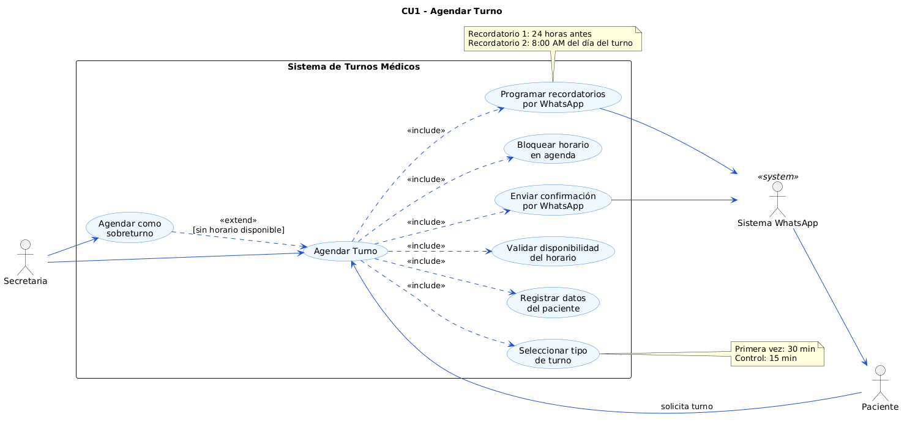
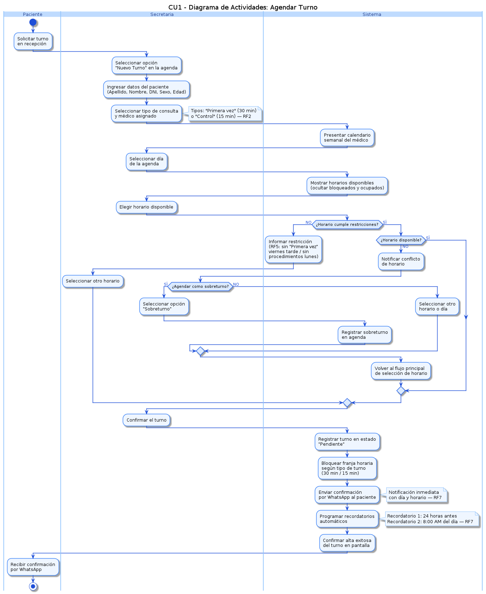
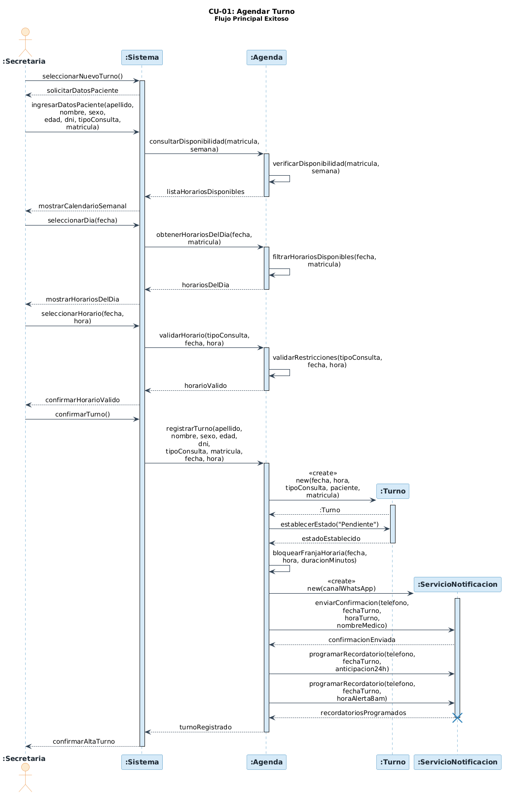
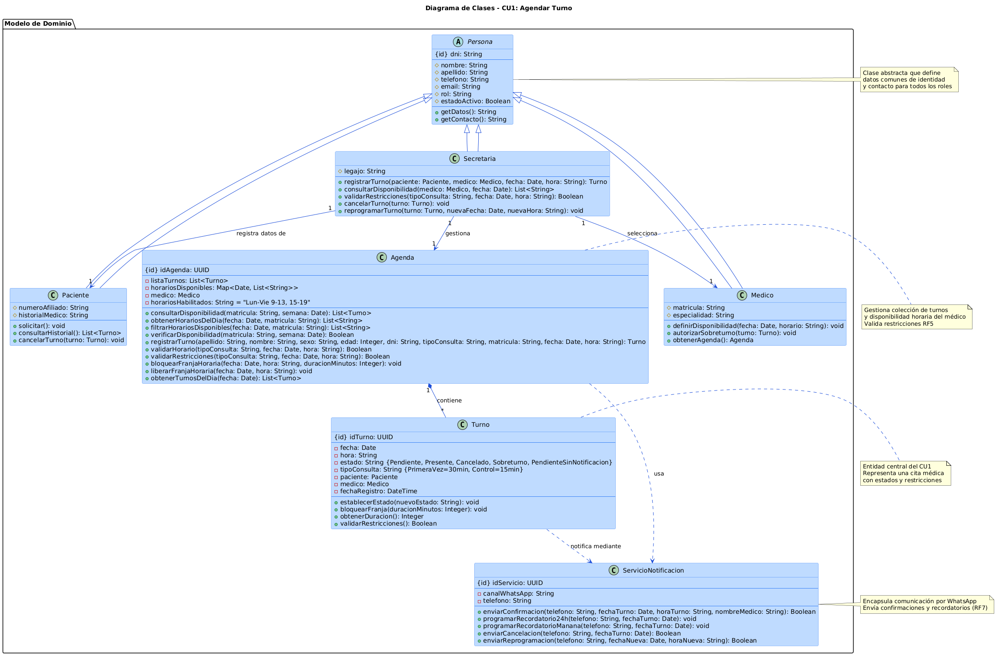

# Caso de Uso 01: Agendar Turno

## Descripción General

Este documento presenta el análisis funcional completo del caso de uso **CU-01 Agendar Turno**, que permite a la secretaria registrar un turno para un paciente con un médico, validando disponibilidad según horarios definidos, tipos de turno y restricciones específicas, finalizando con notificaciones automáticas al paciente.

---

## Actores

| Actor | Tipo | Descripción |
|-------|------|-------------|
| **Secretaria** | Principal | Responsable de registrar los turnos en la agenda del consultorio. Debe estar autenticada con permisos de gestión (RF4). |
| **Paciente** | Secundario | Solicitante del turno. Recibe notificaciones de confirmación y recordatorios por WhatsApp (RF7). |
| **Médico** | Secundario | Profesional médico cuya agenda será consultada y modificada durante el agendamiento. |
| **Sistema de Notificación** | Sistema | Responsable de enviar confirmaciones y recordatorios automáticos por WhatsApp (RF7). |

---

## Objetivo

Permitir que la secretaria agende un turno para un paciente con un médico específico, garantizando:
- Validación de disponibilidad en la agenda semanal (RF1)
- Respeto de tipos de turno y duraciones (RF2)
- Control de conflictos horarios (RF3)
- Verificación de roles y permisos (RF4)
- Cumplimiento de restricciones por día y tipo de consulta (RF5)
- Utilización de horarios habilitados (RF6)
- Notificación inmediata al paciente (RF7)

---

## Flujo Principal

El flujo principal consta de 12 pasos desde el escenario **03-agendar-turno-flujo-principal.md**:

| Paso | Acción | Información Relevante |
|------|--------|----------------------|
| **1** | La secretaria selecciona la opción "Nuevo turno" en la agenda | Usuario autenticado como Secretaria con permisos de gestión (RF4) |
| **2** | El sistema solicita los datos del paciente | Campos requeridos: Apellido, Nombre, Sexo, Edad y DNI |
| **3** | La secretaria ingresa los datos del paciente y selecciona el tipo de consulta y el médico | Tipos de consulta: "Primera vez" (30 min) o "Control" (15 min) - RF2 |
| **4** | El sistema presenta el calendario semanal | Vista semanal de la agenda del médico seleccionado (RF1) |
| **5** | La secretaria selecciona un día para ver los horarios disponibles | Horarios habilitados: Lun-Vie 9-13 y 15-19 (excl. jueves tarde); sábados ocasionales según el médico (RF6) |
| **6** | El sistema muestra horarios disponibles del día, ocultando los bloqueados | Horarios ocupados por turnos previos o bloqueos manuales quedan inhabilitados (RF3) |
| **7** | La secretaria elige un horario disponible | Debe cumplir restricciones: sin procedimientos los lunes; sin "Primera vez" los viernes por la tarde (RF5) |
| **8** | La secretaria confirma el turno | Confirmación explícita de la operación |
| **9** | El sistema registra el turno en estado "Pendiente" y bloquea la franja horaria | La duración bloqueada depende del tipo: 30 min para "Primera vez", 15 min para "Control" (RF2, RF3) |
| **10** | El sistema envía notificación por WhatsApp al paciente | Notificación inmediata de confirmación (RF7) |
| **11** | El sistema programa recordatorios automáticos para el paciente | Recordatorio 24 horas antes y a las 8:00 AM del día del turno (RF7) |
| **12** | El sistema confirma el alta exitosa del turno | Cierre del flujo principal |

---

## Flujos Alternativos

### Flujo Alternativo 1: Sobreturno Permitido

**Condición:** El médico permite sobreturno en su configuración.

| Paso | Acción |
|------|--------|
| 6a | El sistema muestra horarios disponibles incluyendo la opción de sobreturno con indicador visual |
| 7a | La secretaria selecciona el sobreturno (si está permitido) |
| 9a | El sistema registra el turno en estado "Sobreturno" en lugar de "Pendiente" |
| Continúa en paso 10 | Envío de notificación |

### Flujo Alternativo 2: Restricción Violada

**Condición:** El horario seleccionado viola una restricción.

| Paso | Acción |
|------|--------|
| 7b | El usuario intenta seleccionar un horario que viola restricciones (ej: viernes tarde para "Primera vez") |
| 8b | El sistema muestra mensaje de error indicando la restricción violada |
| 7b-alt | La secretaria debe seleccionar otro horario válido |
| Retorna a paso 7 | Seleccionar nuevo horario |

### Flujo Alternativo 3: No Hay Horarios Disponibles

**Condición:** La agenda del médico está completamente ocupada.

| Paso | Acción |
|------|--------|
| 6c | El sistema muestra que no hay horarios disponibles en la semana |
| 8c | El sistema sugiere ver agenda de otro médico o posponer |
| 8c-alt | La secretaria puede reintentar con otro médico o cancelar la operación |

### Flujo Alternativo 4: Falla en Envío de Notificación

**Condición:** No se puede enviar la notificación por WhatsApp.

| Paso | Acción |
|------|--------|
| 10d | El sistema intenta enviar notificación y falla |
| 10d-alt | El sistema registra el error y permite reintento manual |
| 12d | El turno se registra pero se marca con estado "Pendiente - Sin Notificación" |

---

## Tabla de Trazabilidad de Requisitos

| Requisito | Descripción | Paso(s) del Flujo | Validación |
|-----------|-------------|-------------------|-----------|
| **RF1** | La agenda debe mostrar vista semanal de disponibilidad | Pasos 4, 5 | El sistema presenta calendario semanal de la agenda del médico |
| **RF2** | El sistema debe soportar dos tipos de turno: "Primera vez" (30 min) y "Control" (15 min) | Pasos 3, 9 | La duración bloqueada corresponde al tipo seleccionado |
| **RF3** | El sistema debe validar y bloquear conflictos horarios | Pasos 6, 9 | Horarios ocupados se muestran como no disponibles |
| **RF4** | Acceso restringido por rol: solo Secretaria puede agendar | Paso 1 | Usuario autenticado como Secretaria con permisos verificados |
| **RF5** | Restricciones especiales: sin procedimientos lunes; sin "Primera vez" viernes tarde | Paso 7 | El sistema valida restricciones antes de confirmar |
| **RF6** | Horarios habilitados: Lun-Vie 9-13 y 15-19 (excl. jueves tarde); sábados por indicación del médico | Pasos 5, 6 | Solo horarios válidos se presentan como disponibles |
| **RF7** | Notificaciones automáticas por WhatsApp: confirmación inmediata y recordatorios (24h antes y 8:00 AM del turno) | Pasos 10, 11 | Notificaciones enviadas automáticamente al paciente |

---

## 1. Diagrama de Casos de Uso



**Actores y relaciones:**
- **Secretaria** → Inicia el caso de uso, selecciona paciente, médico y horario disponible
- **Paciente** → Recibe notificaciones de confirmación y recordatorios por WhatsApp
- **Médico** → Su agenda es consultada y modificada para el bloqueo horario
- **Sistema de Notificación** → Responsable de enviar confirmaciones y recordatorios automáticos

---

## 2. Diagrama de Actividades



**Swimlanes:**
- **|Secretaria|** → Selecciona datos del paciente, tipo de consulta, médico, día, horario y confirma el turno
- **|SistemaTurnosMedicos|** → Valida autenticación, consulta disponibilidad, valida restricciones, registra turno y bloquea horarios
- **|ServicioNotificacion|** → Envía confirmaciones y programa recordatorios automáticos

**Decisiones clave del flujo:**
- **¿Hay horarios disponibles?** (Paso 5) → Si no hay, mostrar mensaje y finalizar
- **¿El horario cumple restricciones?** (Paso 7) → Si viola restricción (ej: viernes tarde para "Primera vez"), mostrar error y reintentar
- **¿Se registra correctamente?** (Paso 9) → Si falla, mostrar error; si éxito, continuar con notificaciones

---

## 3. Diagrama de Secuencia



**Participantes:**
- `:Secretaria` (actor)
- `sistema:SistemaTurnosMedicos` (sistema)
- `agenda:Agenda` (objeto)
- `turno:Turno` (objeto temporal, creado durante la ejecución)
- `notificacion:ServicioNotificacion` (servicio)
- `:Paciente` (receptor de notificaciones)

**Mensajes clave:**
- `consultarDisponibilidad(medico, semana)` → Retorna lista de horarios disponibles
- `validarRestricciones(horario, tipo)` → Valida si el horario cumple restricciones de negocio
- `registrarTurno(paciente, medico, horario, tipo)` → Crea nuevo turno y bloquea franja horaria
- `enviarConfirmacion(paciente, turno)` → Envía notificación WhatsApp de confirmación
- `programarRecordatorio(paciente, turno, tiempo)` → Programa recordatorios automáticos

**Objetos temporales destruidos:**
- `turno:Turno` → No se destruye; persiste en la base de datos con estado "Pendiente" o "Sobreturno"

---

## 4. Diagrama de Clases del Caso de Uso



## 5. Clases Involucradas

| Clase | Responsabilidad (según tarjeta CRC) | Tarjeta CRC |
|-------|-------------------------------------|-------------|
| **Persona** | Mantener datos comunes de identificación y contacto | [00-tarjeta-crc-persona.md](../../herramientas-agile/tarjetas-crc/00-tarjeta-crc-persona.md) |
| **Paciente** | Solicitar turnos, recibir notificaciones, mantener historial | [01-tarjeta-crc-paciente.md](../../herramientas-agile/tarjetas-crc/01-tarjeta-crc-paciente.md) |
| **Médico** | Gestionar agenda, definir horarios habilitados y restricciones | [02-tarjeta-crc-medico.md](../../herramientas-agile/tarjetas-crc/02-tarjeta-crc-medico.md) |
| **Secretaria** | Registrar turnos, validar disponibilidad y restricciones | [03-tarjeta-crc-secretaria.md](../../herramientas-agile/tarjetas-crc/03-tarjeta-crc-secretaria.md) |
| **Turno** | Representar turno agendado, gestionar estado y validaciones | [04-tarjeta-crc-turno.md](../../herramientas-agile/tarjetas-crc/04-tarjeta-crc-turno.md) |
| **Agenda** | Gestionar horarios disponibles, turnos registrados y bloqueos | [05-tarjeta-crc-agenda.md](../../herramientas-agile/tarjetas-crc/05-tarjeta-crc-agenda.md) |
| **ServicioNotificacion** | Enviar confirmaciones y recordatorios automáticos por WhatsApp | [08-tarjeta-crc-servicio-notificacion.md](../../herramientas-agile/tarjetas-crc/08-tarjeta-crc-servicio-notificacion.md) |

---

## 6. Relaciones UML

| Relación | Clases | Justificación |
|----------|--------|---------------|
| **Herencia** | Paciente → Persona | Paciente es especialización de Persona con atributos específicos de paciente |
| **Herencia** | Médico → Persona | Médico es especialización de Persona con datos de especialidad |
| **Herencia** | Secretaria → Persona | Secretaria es especialización de Persona con permisos de gestión |
| **Gestión** | Secretaria → Turno | Secretaria registra y gestiona múltiples turnos (1-a-muchos) |
| **Solicitud** | Paciente → Turno | Paciente puede solicitar múltiples turnos (1-a-muchos) |
| **Asignación** | Turno → Médico | Un turno se asigna a un médico específico (1-a-1) |
| **Gestión** | Médico → Agenda | Un médico tiene una única agenda (1-a-1) |
| **Contiene** | Agenda → Turno | Una agenda contiene múltiples turnos registrados (1-a-muchos) |
| **Notificación** | Turno → ServicioNotificacion | Un turno requiere notificación al paciente (dependencia) |

---

## 7. Pseudocódigo

```pseudocode
INICIO Agendar Turno

// Contexto: Secretaria autenticada inicia agendamiento de nuevo turno para paciente.
// Precondición: Usuario tiene rol Secretaria y permisos de gestión (RF4).

Secretaria secretaria = obtenerUsuarioActual()
SI secretaria.rol != "Secretaria" O secretaria.permisoGestion == FALSO
    MOSTRAR "Error: Acceso denegado"
    RETORNAR
FIN SI

// === FASE 1: Ingreso de datos del paciente y preferencias ===

secretaria.seleccionarNuevoTurno()
MOSTRAR formulario "Nuevo Turno"

// Recopilación de datos del paciente - paso 1 a 3 del flujo principal
apellido = SOLICITAR "Apellido del paciente"
nombre = SOLICITAR "Nombre del paciente"
sexo = SOLICITAR "Sexo"
edad = SOLICITAR "Edad"
dni = SOLICITAR "DNI"

tipoConsulta = SELECCIONAR entre ["Primera vez" (30 min), "Control" (15 min)]
matricula = SELECCIONAR médico de lista

// === FASE 2: Consultar disponibilidad semanal - paso 4 ===

// Validar disponibilidad en toda la semana del médico seleccionado
horariosDisponibles = agenda.consultarDisponibilidad(matricula, semana_actual)

SI horariosDisponibles ESTA VACIO
    MOSTRAR "No hay horarios disponibles esta semana para este médico"
    RETORNAR
FIN SI

MOSTRAR calendario_semanal con horariosDisponibles

// === FASE 3: Selección de día y horario con validaciones - pasos 5 a 7 ===

dia_seleccionado = SOLICITAR "Seleccione un día de la semana"

// Obtener horarios disponibles del día específico
horariosDelDia = agenda.obtenerHorariosDelDia(dia_seleccionado, matricula)

SI horariosDelDia ESTA VACIO
    MOSTRAR "No hay horarios disponibles para este día"
    RETORNAR
FIN SI

// Filtrar horarios eliminando bloqueados y ocupados
horariosDisponibles = agenda.filtrarHorariosDisponibles(dia_seleccionado, matricula)

MOSTRAR horariosDisponibles

// Seleccionar y validar horario según restricciones de negocio
REPETIR
    hora_seleccionada = SOLICITAR "Seleccione un horario disponible"
    
    // Validación de restricciones (RF5): sin "Primera vez" viernes tarde, sin procedimientos lunes
    esValido = agenda.validarRestricciones(tipoConsulta, dia_seleccionado, hora_seleccionada)
    
    SI esValido == FALSO
        MOSTRAR "Este horario viola una restricción de negocio"
        CONTINUAR
    FIN SI
    
    SALIR
FIN REPETIR

// === FASE 4: Confirmación del usuario - paso 8 ===

MOSTRAR resumen (paciente: {apellido, nombre, dni}, medico: matricula, tipo: tipoConsulta, dia: dia_seleccionado, hora: hora_seleccionada)
confirmacion = SOLICITAR "¿Confirmar agendamiento?"

SI confirmacion == FALSO
    MOSTRAR "Agendamiento cancelado"
    RETORNAR
FIN SI

// === FASE 5: Registro de turno y bloqueo de franja horaria - paso 9 ===

// Crear turno con validación: registra datos y retorna objeto Turno
turno = agenda.registrarTurno(
    apellido, nombre, sexo, edad, dni,
    tipoConsulta, matricula,
    dia_seleccionado, hora_seleccionada
)

// Determinar duración según tipo de turno (RF2)
duracion = (tipoConsulta == "Primera vez") ? 30 : 15

// Bloquear franja horaria en la agenda del médico
agenda.bloquearFranjaHoraria(dia_seleccionado, hora_seleccionada, duracion)

// Establecer estado del turno a "Pendiente"
turno.establecerEstado("Pendiente")

// === FASE 6: Notificación al paciente - paso 10 ===

INTENTAR
    // Crear servicio de notificación para enviar WhatsApp
    servicioNotificacion = CREAR ServicioNotificacion(canalWhatsApp)
    
    // Enviar confirmación inmediata con datos del turno (RF7)
    servicioNotificacion.enviarConfirmacion(
        paciente.numeroWhatsApp,
        dia_seleccionado,
        hora_seleccionada,
        nombreMedico
    )
    
EXCEPTO error
    // Si falla el envío, registrar error pero no bloquear agendamiento
    REGISTRAR error en log
    turno.establecerEstado("Pendiente - Sin Notificación")
FIN INTENTAR

// === FASE 7: Programación de recordatorios automáticos - paso 11 ===

// Recordatorio 24 horas antes del turno (RF7)
servicioNotificacion.programarRecordatorio(
    paciente.numeroWhatsApp,
    dia_seleccionado,
    anticipacion_24horas
)

// Recordatorio a las 8:00 AM del día del turno (RF7)
servicioNotificacion.programarRecordatorio(
    paciente.numeroWhatsApp,
    dia_seleccionado,
    horaAlerta_8am
)

// === FASE 8: Confirmación de alta exitosa - paso 12 ===

MOSTRAR "Turno agendado exitosamente"
MOSTRAR detalles_confirmacion (
    id_turno: turno.idTurno,
    paciente: {apellido, nombre},
    medico: nombreMedico,
    tipo_consulta: tipoConsulta,
    fecha: dia_seleccionado,
    hora: hora_seleccionada,
    estado: "Pendiente"
)

RETORNAR turno

FIN Agendar Turno
```
