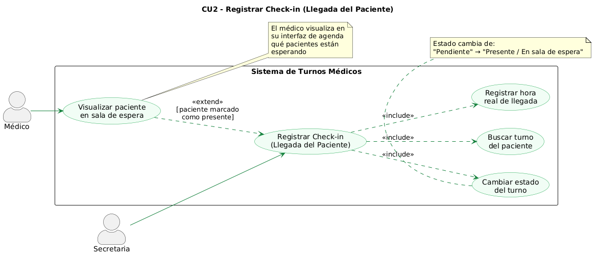
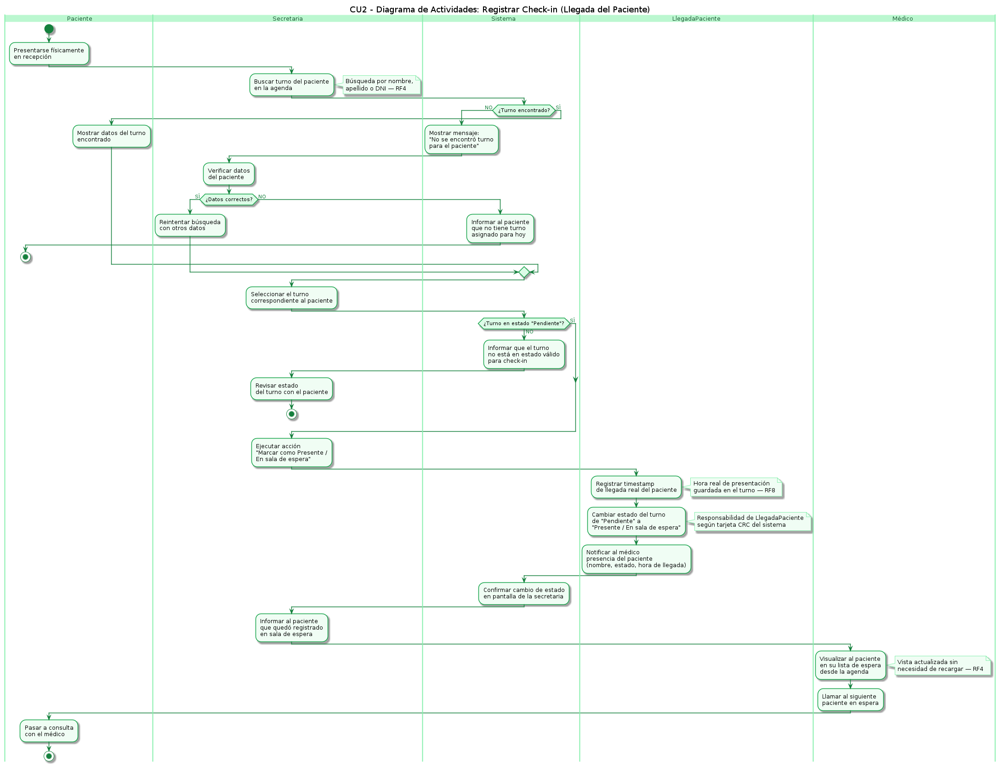
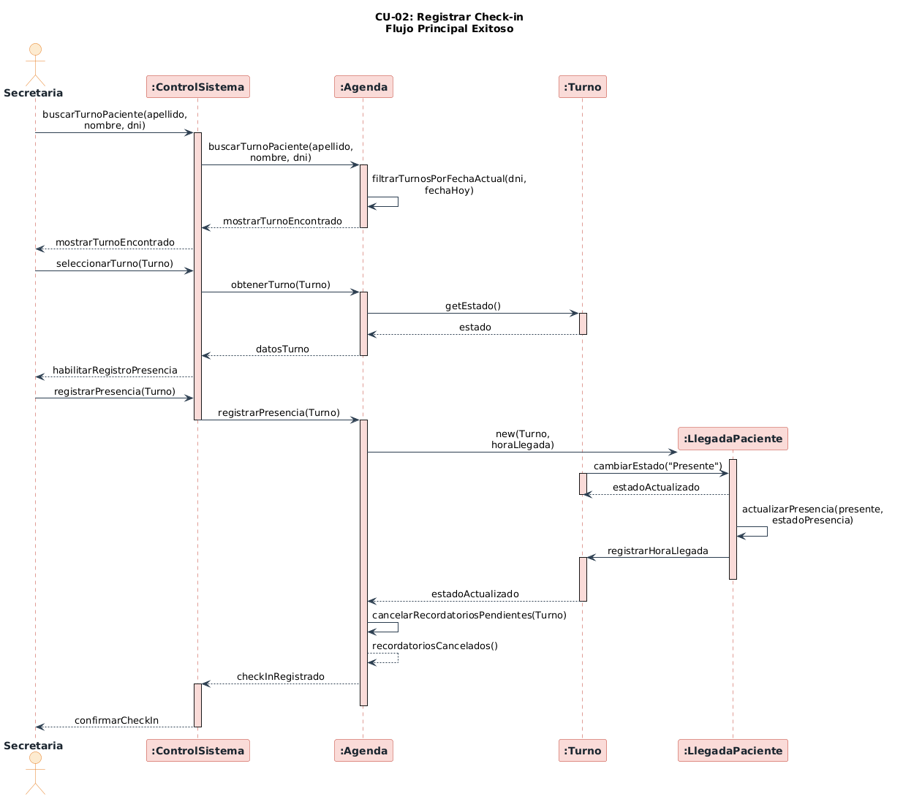
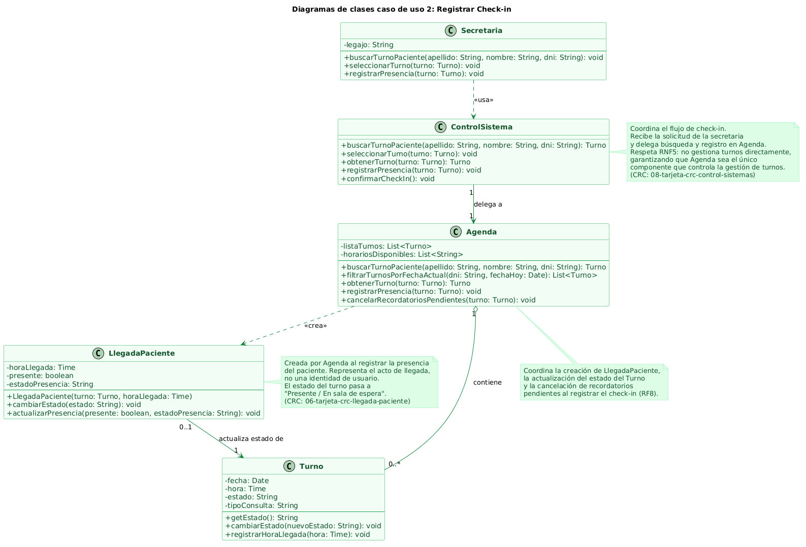

## 1. Descripción y Trazabilidad con Requisitos Funcionales

### CASO DE USO 2. Registrar Check-in (Llegada del Paciente)

Descripción: Cuando el paciente llega físicamente, la secretaria lo busca en la agenda y marca su estado como "Presente" o "En sala de espera" para informar al Médico que el paciente se encuentra esperando en la sala de espera. El sistema registra el horario real en que el turno pasó del estado pendiente a presente o en sala.

Actores: Secretaria, Médico.

Objetivo: Registrar el horario real en la que el paciente se presenta en recepción para que el Médico pueda visualizarlo como "presente" en el sistema.

 ### **Pasos desempenados (ruta principal)** | **Informacion para los pasos** |
|---|---|
| 1. El paciente se presenta en recepcion. | Evento fisico que inicia el flujo. |
| 2. La secretaria busca el turno del paciente en la agenda. | Busqueda por nombre, apellido o DNI del paciente. |
| 3. La secretaria selecciona el turno correspondiente. | Turno en estado "Pendiente" para la fecha actual. |
| 4. La secretaria ejecuta la accion de marcar como "Presente" o "En sala de espera". | Opcion habilitada para usuarios con rol Secretaria (RF4). |
| 5. El sistema registra el horario real de presentacion del paciente. | Timestamp de llegada guardado en el turno (RF8). |
| 6. El sistema cambia el estado del turno de "Pendiente" a "Presente o en sala de espera". | Actualizacion de estado persistida en la agenda (RF8). |
| 7. El medico visualiza al paciente en espera desde su interfaz del calendario. | Vista del medico actualizada en tiempo real (RF4). |
| 8. El sistema confirma el cambio de estado en pantalla. | Mensaje de exito visible para la secretaria. |


### Requerimentos funcionales que satisface:
| ID | Requisito Funcional | Cómo lo satisface este caso de uso |
|----|------------------------------------------------------|-------------------------------------|
| RF[4] | [Roles y Privilegios: Definir perfiles para Secretaria (gestión), Paciente (consulta/cancelación) y Médico (autorización de sobreturnos y agenda)] | Depende el perfil del usuario va a poder registrar el check-in, esto solo lo debe hacer el usuario de perfil secretaria  |
| RF[8] | [Registro de Presencia: Incorporar un estado de "check-in" para marcar la llegada del paciente a la sala de espera] | Al indicar que el paciente esta presente en la sala de espera se registra con el estado de "check in" |
| RNF[5] | [Control Centralizado: La agenda debe ser el único componente que controle la gestión de los turnos] | Los turnos generados solo se gestionan a travez de la agenda, para poder verificar que el paciente tenga un turno con el médico para ese día y horario se verifica a travez de la agenda |

## 2. Diagrama de Casos de Uso


**Actores y relaciones:**
- [Secretaria] → [Es el actor principal del caso de uso. Su función es registrar la llegada del paciente al consultorio, identificar el turno correspondiente y actualizar su estado para indicar que el paciente se encuentra presente o esperando atención]

- [Médico] → [Participa como actor secundario. Su rol es consultar la información generada por el proceso de check-in para conocer qué pacientes se encuentran en sala de espera y organizar el orden de atención, esto resulta de una extend de "Registrar Check-in"]
- [Extend] → [El Médico pueda ver si el paciente se presento en sala]

## 3. Diagrama de Actividades


*Swimlanes*
- Paciente inicia el proceso al presentarse en recepción (evento físico), por este motivo tiene que ser representado en el diagrama
- Secretaria hace las acciones operativas y la que tiene el perfil con el cual puede interactuar con el sistema para registrar el check-in
- Sistemas hace las validaciones en la agenda y es la forma por la cual se puede interactuar con la agenda
- Médico solo visualiza una vez se haya registrado el check in

**Decisiones clave del flujo:**
- Presentarse físicamente en recepción, es el evento que dispara el flujo
- ¿Turno encontrado?, esta es una bifurcación importante en la cual se puede finalizar el flujo de dos formas diferentes si se encuentra el turno o no. Esto es disparado cuando la secretaria busca el turno del paciente.

## 4. Diagrama de Secuencia


**Participantes:*
- Secretaria (actor)
- ControlSistema (:objeto)
- Agenda (:objeto)
- Turno (:objeto)
- LlegadaPaciente (:objeto)

**Mensajes clave:**
- [buscarTurnoPaciente(apellido,\nnombre, dni)] → [Permite encontrar el turno del paciente si ya estaba generado]
- [registrarPresencia(Turno)] → [Inicia el proceso para cambiar el estado a "Presente" para indicar que el paciente se encuentra en la sala]
- [CambiarEstadoPresente] → [Modifica el estado del turno de "Pendiente" a "Presente"]

## 5. Diagrama de Clases del Caso de Uso


**Clases involucradas:**

| Clase | Responsabilidad (según tarjeta CRC) | Tarjeta CRC |
|-------|-------------------------------------|-------------|
| Secretaria | Registrar turnos; cancelar o reprogramar turnos | [05-tarjeta-crc-secretaria.md](../../herramientas-agile/tarjetas-crc/05-tarjeta-crc-secretaria.md) |
| ControlSistema | Coordinar el registro de check-in | [08-tarjeta-crc-control-sisitemas.md](../../herramientas-agile/tarjetas-crc/08-tarjeta-crc-control-sisitemas.md) |
| Agenda | Registrar turnos; gestionar disponibilidad | [04-tarjeta-crc-agenda.md](../../herramientas-agile/tarjetas-crc/04-tarjeta-crc-agenda.md) |
| Turno | Registrar turno; confirmar turno; puede cambiar su estado | [03-tarjeta-crc-turno.md](../../herramientas-agile/tarjetas-crc/03-tarjeta-crc-turno.md) |
| LlegadaPaciente | Registrar hora real de llegada; indicar presencia del paciente | [06-tarjeta-crc-llegada-paciente.md](../../herramientas-agile/tarjetas-crc/06-tarjeta-crc-llegada-paciente.md) |

**Relaciones UML:**

| Relación | Clases | Justificación |
|----------|--------|---------------|
| Dependencia `..>` | `Secretaria` → `ControlSistema` | La Secretaria envía mensajes a ControlSistema solo durante la ejecución del caso de uso. No mantiene referencia persistente: es dependencia y no asociación. |
| Asociación `-->` | `ControlSistema "1"` → `"1" Agenda` | ControlSistema necesita conocer a Agenda durante todo su ciclo de vida para poder delegarle. Es asociación (referencia permanente) y no dependencia porque la relación no es puntual. Cardinalidad 1 a 1 por RNF5: una única Agenda centraliza la gestión. |
| Agregación `o--` | `Agenda "1"` → `"0..*" Turno` | Agenda contiene Turnos pero estos tienen identidad propia y pueden existir más allá del ciclo de vida de la Agenda. Es agregación y no composición porque la dependencia de existencia no es absoluta. |
| Dependencia `..>` `<<crea>>` | `Agenda` → `LlegadaPaciente` | Agenda instancia LlegadaPaciente dentro de `registrarPresencia()` pero no guarda referencia a ella una vez finalizada la operación. Es dependencia de creación y no asociación porque el vínculo no persiste en Agenda. |
| Asociación `-->` | `LlegadaPaciente "0..1"` → `"1" Turno` | LlegadaPaciente necesita mantener referencia al Turno para actualizar su estado y registrar la hora real de llegada. Un Turno puede tener 0 LlegadaPaciente (si no se registró check-in aún) o exactamente 1 (si el paciente se presentó). Es asociación y no composición porque Turno existe independientemente de LlegadaPaciente. |


## 6. Pseudocódigo
```text
INICIO CU-02 Registrar Check-in

// El paciente se presenta físicamente en recepción.
// La Secretaria inicia la búsqueda del turno en el sistema.

Turno turnoEncontrado = controlSistema.buscarTurnoPaciente(apellido, nombre, dni)
    // ControlSistema delega en Agenda (RNF5: Agenda es el único componente
    // que controla la gestión de turnos).
    Turno turnoEncontrado = agenda.buscarTurnoPaciente(apellido, nombre, dni)
        // Agenda filtra los turnos del paciente restringiendo a la fecha actual.
        List<Turno> listaTurnos = agenda.filtrarTurnosPorFechaActual(dni, fechaHoy)
        retornar listaTurnos[0]   // primer turno coincidente para hoy

// ControlSistema devuelve el turno encontrado a la Secretaria para que lo vea en pantalla.
mostrar turnoEncontrado a Secretaria


// La Secretaria selecciona el turno del paciente presentado.
controlSistema.seleccionarTurno(turnoEncontrado)

    Turno datosTurno = agenda.obtenerTurno(turnoEncontrado)
        // Agenda consulta el estado actual del turno antes de habilitar el check-in.
        String estado = turnoEncontrado.getEstado()
        // Solo los turnos en estado "Pendiente" pueden recibir check-in.
        SI estado != "Pendiente"
            retornar error: "Turno no válido para check-in"
        SINO
            retornar datosTurno
        FIN SI

// ControlSistema habilita en la interfaz la acción de registrar presencia.
mostrar "Habilitar registro de presencia" a Secretaria


// La Secretaria ejecuta la acción "Marcar como Presente / En sala de espera".
controlSistema.registrarPresencia(turnoEncontrado)

    agenda.registrarPresencia(turnoEncontrado)

        // Agenda registra la hora real de llegada del paciente (RF8).
        Time horaLlegada = obtenerHoraActual()

        // Agenda crea el objeto LlegadaPaciente que representa el acto de llegada.
        // LlegadaPaciente no es una identidad de usuario: existe solo si el paciente llegó.
        LlegadaPaciente llegada = nuevo LlegadaPaciente(turnoEncontrado, horaLlegada)

            // LlegadaPaciente cambia el estado del turno a "Presente".
            llegada.cambiarEstado("Presente")
                turnoEncontrado.cambiarEstado("Presente")
                // El turno queda en estado "Presente / En sala de espera".

            // LlegadaPaciente registra los datos de presencia en sí misma.
            llegada.actualizarPresencia(presente = verdadero, estadoPresencia = "En sala de espera")

            // LlegadaPaciente le indica al Turno que registre la hora real de llegada (RF8).
            turnoEncontrado.registrarHoraLlegada(horaLlegada)

        // Con el check-in registrado, Agenda cancela los recordatorios automáticos
        // pendientes para este turno (ya no tienen sentido: el paciente ya llegó).
        agenda.cancelarRecordatoriosPendientes(turnoEncontrado)

// Agenda confirma a ControlSistema que el check-in fue registrado correctamente.
// ControlSistema confirma el cambio de estado en pantalla a la Secretaria.
mostrar "Check-in confirmado" a Secretaria

// Estado final del sistema:
// - Turno en estado "Presente / En sala de espera".
// - Hora real de llegada registrada en el Turno (RF8).
// - LlegadaPaciente creada y vinculada al Turno.
// - Recordatorios pendientes cancelados.
// - El Médico puede ver al paciente en su lista de espera desde la agenda (RF4).

Retornar "Check-in registrado exitosamente"

FIN CU-02
```
