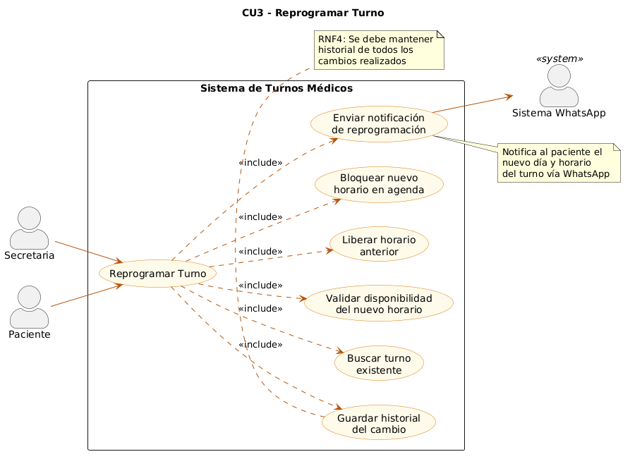
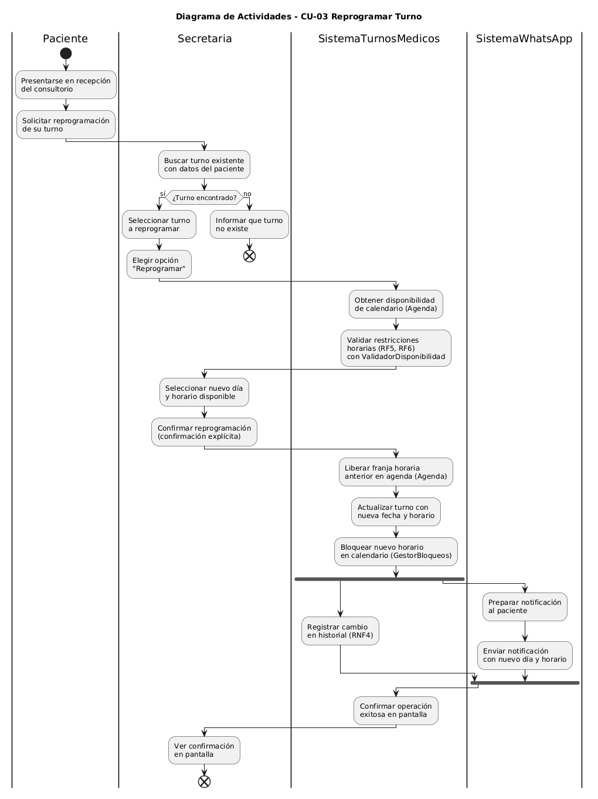
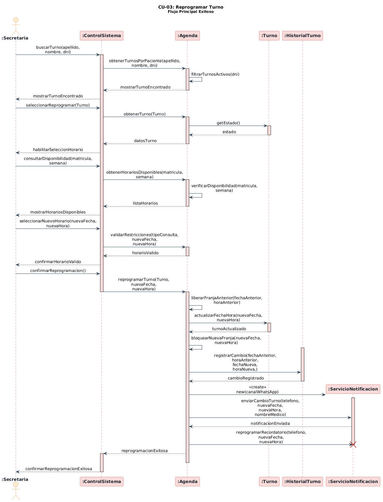
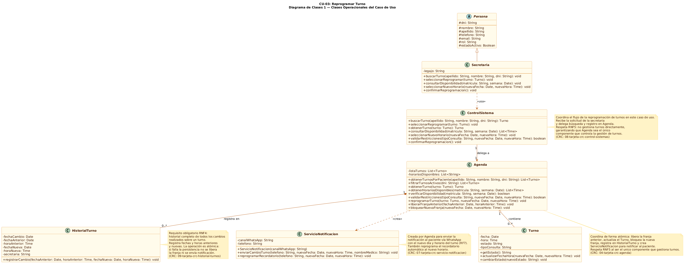

## 1. Descripción y Trazabilidad con Requisitos Funcionales

### CASO DE USO 3. Reprogramar Turno

Descripción: La secretaria selecciona un turno existente para reprogramarlo a otro horario disponible, el sistema debe guardar el historial de estos cambios y enviar una notificación por WhatsApp al paciente para informarle de la modificación.

Actor: Secretaria

Objetivo: Permitir que la Secretaria cambie un turno existente a una nueva fecha y horario disponibles, manteniendo el historial de cambios y notificando al paciente sobre la modificación.

| **Pasos desempenados (ruta principal)** | **Informacion para los pasos** |
|---|---|
| 1. El paciente solicita reprogramar su turno. | Solicitud presencial en recepcion. |
| 2. La secretaria busca el turno en la agenda con los datos del paciente. | Busqueda por apellido, nombre o DNI del paciente. |
| 3. La secretaria selecciona el turno que el paciente desea reprogramar. | Turno en estado "Pendiente" o "Presente". |
| 4. La secretaria elige la opcion "Reprogramar". | Accion habilitada para rol Secretaria (RF4). |
| 5. El sistema presenta el calendario con dias y horarios disponibles. | Disponibilidad respetando horarios habilitados (RF6) y restricciones vigentes (RF5). |
| 6. La secretaria selecciona el nuevo dia y horario para el turno. | Nueva franja que debe estar disponible y cumplir restricciones (RF5, RF6). |
| 7. La secretaria confirma la reprogramacion. | Confirmacion explicita de la operacion. |
| 8. El sistema libera la franja horaria anterior en la agenda. | Horario previo vuelve a estar disponible para nuevos turnos (RF3). |
| 9. El sistema actualiza el turno con la nueva fecha y horario y bloquea la nueva franja. | Cambio persistido con historial de modificacion registrado (RNF4). |
| 10. El sistema envia notificacion por WhatsApp al paciente con el nuevo dia y horario. | Aviso de cambio con datos actualizados del turno (RF7). |
| 11. El sistema confirma la reprogramacion exitosa en pantalla. | Cierre del flujo principal. |

### Requerimentos funcionales que satisface:
| ID | Requisito Funcional | Cómo lo satisface este caso de uso |
|----|------------------------------------------------------|-------------------------------------|
| RF[1] |Gestión de Agenda: El sistema debe generar turnos en un calendario semanal con opción de vista diaria | La secretaria busca el turno en la agenda, selecciona una nueva fecha y horario disponibles, y la agenda actualiza la ocupación de los horarios  |
| RF[3] | Validación de Conflictos: Bloquear horarios ya asignados para evitar solapamientos, permitiendo excepciones solo como sobreturnos autorizado | Validación de Conflictos	Al elegir el nuevo horario, el sistema debe verificar que esté disponible y bloquearlo una vez confirmada la reprogramación. Además, libera el horario anterior. |
| RF[4] | Roles y Privilegios: Definir perfiles para Secretaria (gestión), Paciente (consulta/cancelación) y Médico (autorización de sobreturnos y agenda) | La acción de reprogramar es realizada por la Secretaria, quien posee permisos de gestión de turnos |
| RF[5] | Restricciones Específicas: No permitir procedimientos los lunes ni turnos de "Primera vez" los viernes por la tarde | El nuevo horario del turno debe respetar las restricciones del negocio (horario y días disponibles indicados por sistema). |
| RF[6] | Horarios Definidos: Lunes a viernes de 9-13 y 15-19 (excepto jueves tarde), y sábados ocasionales según defina el médico | La nueva fecha y hora seleccionadas deben encontrarse dentro de los horarios habilitados de atención |
| RF[7] | Notificaciones: Envío de recordatorios por WhatsApp 24 horas antes y a las 8:00 AM del día del turno | Una vez confirmada la reprogramación, el sistema envía una notificación por WhatsApp al paciente informando el nuevo horario |
| RNF[1] | Usabilidad: El personal administrativo debe poder operar el sistema tras una breve capacitación | La secretaria debe poder realizar la reprogramación de manera simple mediante la agenda y el calendario |
| RNF[4] | Integridad de Datos: Es obligatorio mantener un historial de todos los cambios realizados en los turnos | El sistema debe guardar el historial de los cambios realizados sobre el turno |
| RNF[5] | Control Centralizado: La agenda debe ser el único componente que controle la gestión de los turnos | La operación de reprogramación se realiza a través de la agenda, que es el componente responsable de gestionar los turnos |

## 2. Diagrama de Casos de Uso


**Actores y relaciones:**
- [Secretaria] → [Es el actor principal del caso de uso. Su función es reprogramar el horario y día de un turno, identifica el turno correspondiente y modifica el horario y día a uno disponible]

- [Paciente] → [Participa como actor secundario. Su rol es solicitar la reprogramación y recibir la nueva notificación del cambio realizado]

- [ServicioNotificación] → [Participa como actor secundario. Su rol es informar del cambio realizado en el turno al paciente]

## 3. Diagrama de Actividades


Descripión: El paciente solicita la reprogramación de su turno en recepción. La secretaria busca el turno utilizando los datos del paciente y el sistema verifica si dicho turno existe.
Si el turno es encontrado, la secretaria lo selecciona y elige la opción "Reprogramar". El sistema consulta la disponibilidad de la agenda y valida que el nuevo día y horario seleccionados estén libres. Una vez validada la disponibilidad, la secretaria confirma la reprogramación.
Posteriormente, el sistema realiza las acciones necesarias para efectuar el cambio: libera el horario anterior, actualiza el turno con la nueva fecha y hora, bloquea el nuevo horario en la agenda y registra el cambio en el historial. Finalmente, se genera y envía una notificación por WhatsApp al paciente informando el nuevo turno, y el sistema muestra una confirmación de operación exitosa.

*Swimlanes*
- Paciente: inicia el proceso solicitando la reprogramación y recibe la confirmación final.
- Secretaria: realiza las tareas operativas, como buscar el turno, seleccionar el nuevo horario y confirmar la reprogramación.
- SistemaTurnosMedicos: ejecuta las validaciones de disponibilidad, actualiza la agenda, registra el historial del cambio y coordina la operación.
- SistemaWhatsApp: se encarga de preparar y enviar la notificación al paciente con la nueva fecha y horario del turno.

**Decisiones clave del flujo:**
- Presentarse físicamente en recepción, es el evento que dispara el flujo
- ¿Turno encontrado?, esta es una bifurcación importante en la cual se puede finalizar el flujo de dos formas diferentes si se encuentra el turno o no. Esto es disparado cuando la secretaria busca el turno del paciente.
- Liberar franja horaria anterior. Este evento es disparado cuando se confirma el cambio de horario y día en el turno existente.



**Participantes:*
- Secretaria (actor)
- ControlSistema (:objeto)
- Agenda (:objeto)
- Turno (:objeto)
- HistorialTurno (:objeto)
- ServicioNotificación (:objeto temporal)

**Mensajes clave:**
- [buscarTurnoPaciente(apellido,\nnombre, dni)] → [Permite encontrar el turno del paciente si ya estaba generado]
- seleccionarNuevoHorario(nuevaFecha, nuevaHora) → [Selecciona el nuevo horario y fecha del turno solicitado]
- liberarFranjaAnterior(fechaAnterior, horaAnterior) → [Libera el horario que estaba bloqueado una vez se haya reprogramado el turno]
- bloquearNuevaFranja(nuevaFecha, nuevaHora) → [Bloquea el nuevo horario del turno para evitar solapamientos]


**Objetos temporales destruidos:**
ServicioNotificacion es un objeto temporal que solo tiene la responsabilidad de notificar la creación o cambios de los turnos al paciente, una vez realizada la acción este objeto se destruye.

## 5. Diagrama de Clases del Caso de Uso


**Clases involucradas:**

| Clase | Responsabilidad (según tarjeta CRC) | Tarjeta CRC |
|-------|-------------------------------------|-------------|
| Secretaria | Cancelar o reprogramar turnos; consultar disponibilidad | [05-tarjeta-crc-secretaria.md](../../herramientas-agile/tarjetas-crc/05-tarjeta-crc-secretaria.md) |
| ControlSistema | Coordinar la reprogramación de turnos; solicitar notificaciones de cambios | [08-tarjeta-crc-control-sisitemas.md](../../herramientas-agile/tarjetas-crc/08-tarjeta-crc-control-sisitemas.md) |
| Agenda | Registrar turnos; bloquear fechas; gestionar disponibilidad | [04-tarjeta-crc-agenda.md](../../herramientas-agile/tarjetas-crc/04-tarjeta-crc-agenda.md) |
| Turno | Reprogramar turno; puede modificar fecha y hora | [03-tarjeta-crc-turno.md](../../herramientas-agile/tarjetas-crc/03-tarjeta-crc-turno.md) |
| HistorialTurno | Registrar cambios realizados sobre un turno; mantener trazabilidad de reprogramaciones | [09-tarjeta-crc-historial-turnos.md](../../herramientas-agile/tarjetas-crc/09-tarjeta-crc-historial-turnos.md) |
| ServicioNotificacion | Enviar notificación de cambio de turno; reprogramar recordatorio automático | [07-tarjeta-crc-servicio-notificacion.md](../../herramientas-agile/tarjetas-crc/07-tarjeta-crc-servicio-notificacion.md) |

**Relaciones UML:**

| Relación | Clases | Justificación |
|----------|--------|---------------|
| Herencia | `Persona` <|-- `Secretaria` | Secretaria hereda los atributos y comportamientos comunes definidos en la superclase Persona |
| Dependencia `..>` | `Secretaria` → `ControlSistema` | La Secretaria envía mensajes a ControlSistema solo durante la ejecución del caso de uso. No mantiene referencia persistente: es dependencia y no asociación. |
| Asociación `-->` | `ControlSistema "1"` → `"1" Agenda` | ControlSistema conoce a Agenda durante todo su ciclo de vida para delegar la reprogramación. Es asociación y no dependencia porque la relación no es puntual. Cardinalidad 1 a 1 por RNF5. |
| Agregación `o--` | `Agenda "1"` → `"0..*" Turno` | Agenda administra Turnos pero estos tienen identidad propia. Es agregación y no composición porque un Turno puede conceptualmente existir sin estar vinculado a la misma instancia de Agenda. |
| Composición `*--` | `Agenda "1"` → `"0..*" HistorialTurno` | Cada registro de HistorialTurno solo tiene sentido dentro del contexto de la Agenda que gestiona el turno modificado. Si la Agenda se destruye, sus registros de historial también. Es composición y no agregación porque HistorialTurno no tiene existencia independiente. Cumple RNF4. |
| Dependencia `..>` `<<create>>` | `Agenda` → `ServicioNotificacion` | Agenda instancia ServicioNotificacion dentro de `reprogramarTurno()` y lo destruye al finalizar la misma operación. No guarda referencia. Es dependencia de creación y no asociación porque el objeto es temporal (`create`/`destroy` en el diagrama de secuencia). |

## 6. Pseudocódigo
```text
INICIO CU-03 Reprogramar Turno

// El paciente solicita reprogramar su turno presencialmente en recepción.
// La Secretaria busca el turno en el sistema con los datos del paciente.

Turno turnoEncontrado = controlSistema.buscarTurno(apellido, nombre, dni)
    // ControlSistema delega en Agenda (RNF5).
    List<Turno> listaTurnos = agenda.obtenerTurnosPorPaciente(apellido, nombre, dni)
        // Agenda filtra para mostrar solo los turnos activos del paciente.
        List<Turno> listaTurnos = agenda.filtrarTurnosActivos(dni)
        retornar listaTurnos

// ControlSistema devuelve el turno encontrado a la Secretaria para que lo vea en pantalla.
mostrar turnoEncontrado a Secretaria


// La Secretaria elige la opción "Reprogramar" sobre el turno seleccionado.
controlSistema.seleccionarReprogramar(turnoEncontrado)

    Turno datosTurno = agenda.obtenerTurno(turnoEncontrado)
        // Agenda verifica el estado del turno antes de habilitar la reprogramación.
        String estado = turnoEncontrado.getEstado()
        // Solo turnos en estado "Pendiente" pueden ser reprogramados.
        SI estado != "Pendiente"
            retornar error: "Turno no habilitado para reprogramar"
        SINO
            retornar datosTurno
        FIN SI

// ControlSistema habilita en la interfaz la selección de nuevo horario.
mostrar "Habilitar selección de horario" a Secretaria


// La Secretaria consulta los horarios disponibles para el médico en la semana elegida.
List<Time> listaHorarios = controlSistema.consultarDisponibilidad(matricula, semana)

    List<Time> listaHorarios = agenda.obtenerHorariosDisponibles(matricula, semana)
        // Agenda verifica la disponibilidad real de la agenda del médico.
        boolean disponible = agenda.verificarDisponibilidad(matricula, semana)
        SI disponible
            retornar listaHorarios
        SINO
            retornar lista vacía
        FIN SI

// ControlSistema muestra los horarios disponibles a la Secretaria.
mostrar listaHorarios a Secretaria


// La Secretaria selecciona el nuevo día y horario para el turno.
controlSistema.seleccionarNuevoHorario(nuevaFecha, nuevaHora)

    // ControlSistema valida que el nuevo horario cumpla las restricciones del sistema
    // antes de habilitarle la confirmación a la Secretaria (RF5, RF6).
    boolean horarioValido = agenda.validarRestricciones(tipoConsulta, nuevaFecha, nuevaHora)
    SI horarioValido
        retornar horarioValido
    SINO
        retornar error: "El horario seleccionado no cumple las restricciones"
    FIN SI

// ControlSistema confirma a la Secretaria que el horario es válido.
mostrar "Horario válido, confirme la reprogramación" a Secretaria


// La Secretaria confirma explícitamente la reprogramación.
controlSistema.confirmarReprogramacion()

    // La operación completa es atómica: si cualquier paso falla,
    // no se libera la franja anterior ni se envía notificación (RNF4).
    agenda.reprogramarTurno(turnoEncontrado, nuevaFecha, nuevaHora)

        // Paso 1: Agenda libera la franja horaria anterior para que quede disponible.
        agenda.liberarFranjaAnterior(fechaAnterior, horaAnterior)

        // Paso 2: Agenda actualiza la fecha y hora del Turno con los nuevos datos.
        turnoEncontrado.actualizarFechaHora(nuevaFecha, nuevaHora)
        // El Turno queda con la nueva fecha y hora persistidas.

        // Paso 3: Agenda bloquea la nueva franja para que no pueda asignarse a otro turno.
        agenda.bloquearNuevaFranja(nuevaFecha, nuevaHora)

        // Paso 4: Agenda registra el cambio en el historial (RNF4: obligatorio).
        // HistorialTurno guarda los datos anteriores y los nuevos para trazabilidad.
        HistorialTurno historialTurno = nuevo HistorialTurno()
        historialTurno.registrarCambio(fechaAnterior, horaAnterior, fechaNueva, horaNueva)

        // Paso 5: Agenda crea un ServicioNotificacion temporal para notificar al paciente.
        // ServicioNotificacion es un objeto de vida corta: se crea y destruye en esta operación.
        ServicioNotificacion svcNotificacion = nuevo ServicioNotificacion(canalWhatsApp)

            // Envía al paciente el mensaje de WhatsApp con el nuevo día y horario (RF7).
            svcNotificacion.enviarCambioTurno(telefono, nuevaFecha, nuevaHora, nombreMedico)

            // Reprograma el recordatorio automático para que dispare en el nuevo horario.
            svcNotificacion.reprogramarRecordatorio(telefono, nuevaFecha, nuevaHora)

        // ServicioNotificacion se destruye: no persiste más allá de esta operación.
        destruir svcNotificacion

// Agenda informa a ControlSistema que la reprogramación fue exitosa.
// ControlSistema confirma la operación exitosa en pantalla a la Secretaria.
mostrar "Reprogramación exitosa" a Secretaria

// Estado final del sistema:
// - El Turno tiene la nueva fecha y hora (RF3).
// - La franja horaria anterior quedó liberada y disponible.
// - La nueva franja horaria está bloqueada.
// - El historial de cambios fue registrado obligatoriamente (RNF4).
// - El paciente recibió notificación por WhatsApp con los nuevos datos (RF7).

Retornar "Reprogramación registrada exitosamente"

FIN CU-03
```