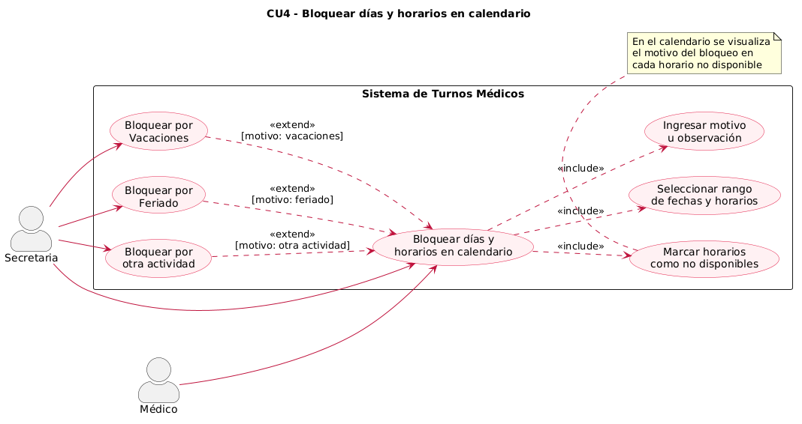
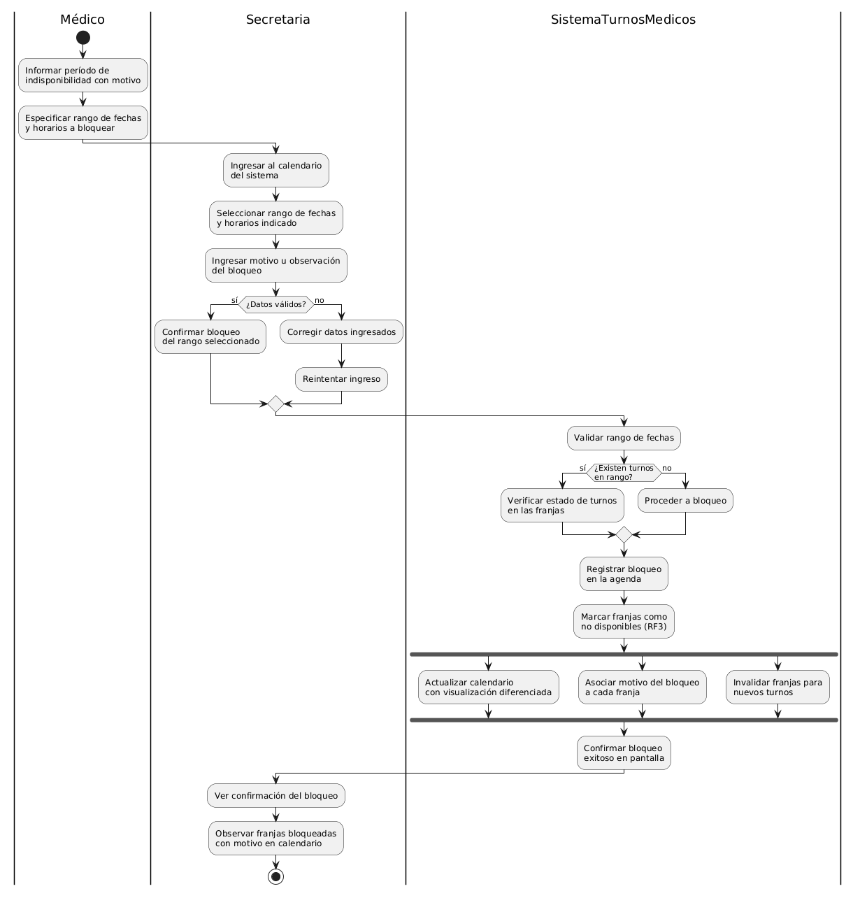
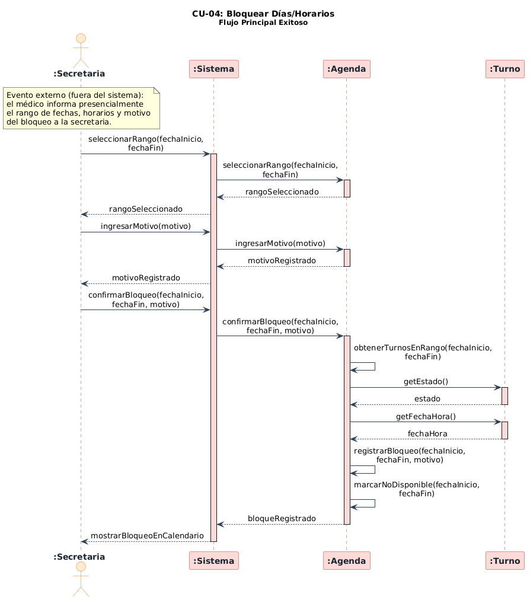
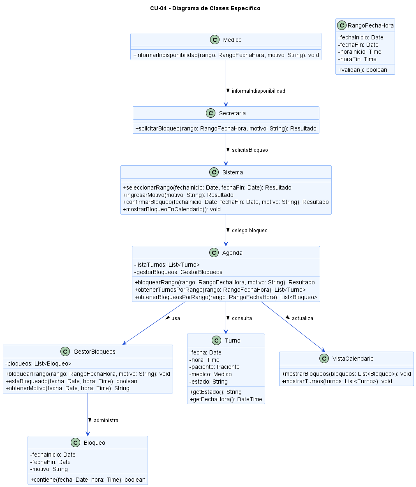

# CU-04: Bloquear días/horarios en calendario

## 1. Descripción y trazabilidad con requisitos funcionales de A1
El caso de uso CU-04 permite que la secretaria registre en el calendario médico un rango de fechas y horarios como no disponibles, junto con el motivo del bloqueo (vacaciones, feriado u otra actividad del médico). El objetivo es que esas franjas queden inhabilitadas para nuevos turnos y que el motivo quede visible en la agenda.

### Trazabilidad con requisitos de A1
- **RF3**: El sistema bloquea horarios ya asignados o no disponibles y evita solapamientos al marcar las franjas como no disponibles.
- **RF4**: Solo un usuario con rol Secretaría puede gestionar el bloqueo; el médico autoriza y explica el intervalo a bloquear.
- **RF5**: El sistema debe conocer las restricciones específicas de días y horarios del consultorio cuando valida rangos de bloqueo.
- **RF6**: El bloqueo se aplica dentro de los horarios habilitados definidos para la agenda (Lun-Vie 9-13 y 15-19, sábados ocasionales).
- **RNF5**: La agenda es el componente centralizado que controla la gestión de los turnos y los bloqueos.

## 2. Diagrama de casos de uso de A2


El diagrama muestra a la Secretaria y al Médico como actores del caso de uso. Incluye los subcasos de selección del rango de fechas, ingreso del motivo y marcado de horarios como no disponibles, garantizando que el motivo quede asociado a cada bloqueo.

## 3. Diagrama de actividades de A3


El diagrama de actividades refleja el flujo principal con las swimlanes de Médico, Secretaria y Sistema. El proceso valida datos, verifica si existen turnos en el rango, registra el bloqueo con GestorBloqueos y actualiza la agenda con franjas no disponibles.

## 4. Diagrama de secuencia de A3


El diagrama de secuencia describe la interacción entre Secretaria, Sistema, Agenda y Turno. Muestra la confirmación de bloqueo, la verificación de turnos existentes en el rango y la notificación al usuario de que la franja quedó bloqueada.

## 5. Diagrama de clases específico



Este diseño enfatiza que la `Agenda` centraliza la gestión de bloqueos y turnos, mientras que `GestorBloqueos` almacena los rangos bloqueados y `VistaCalendario` presenta el estado actualizado. La `Secretaria` interactúa con la `Agenda`; el `Médico` provee la información del bloqueo.

## 6. Coherencia con tarjetas CRC
- La tarjeta CRC de `Secretaria` describe su responsabilidad de "Gestionar agenda" y "Consultar disponibilidad", lo que coincide con la interacción del actor en CU-04.
- La tarjeta CRC de `Agenda` indica que puede "Bloquear fechas" y "Gestionar disponibilidad", lo que confirma que la `Agenda` es el componente adecuado para centralizar el bloqueo de franjas.
- La tarjeta CRC de `Turno` muestra que conoce fecha, hora y estado, respaldando la verificación de turnos existentes antes de aplicar un bloqueo.

## 7. Pseudocódigo orientado a objetos
```pseudo
class Resultado {
    - exito: boolean
    - mensaje: String
    
    {static} error(msg: String): Resultado
    {static} ok(msg: String): Resultado
}

class ValidadorDisponibilidad {
    validarRango(rango: RangoFechaHora): boolean {
        // Valida que el rango esté dentro de los horarios habilitados
        // del consultorio (Lun-Vie 9-13 y 15-19, sábados ocasionales)
        return rango.estaEnHorariosHabilitados()
    }
}

class Secretaria {
    autenticar(): boolean
    solicitarBloqueo(rango, motivo): Resultado {
        if not self.autenticar() then
            return Resultado.error("Acceso denegado")
        // Delegación a través de ControlSistema
        return ControlSistema.instancia().confirmarBloqueo(rango, motivo)
    }
}

class ControlSistema {
    confirmarBloqueo(rango, motivo): Resultado {
        return Agenda.instancia().bloquearRango(rango, motivo)
    }
}

class Agenda {
    - listaTurnos: List<Turno>
    - gestorBloqueos: GestorBloqueos
    
    bloquearRango(rango, motivo): Resultado {
        if not ValidadorDisponibilidad.instancia().validarRango(rango) then
            return Resultado.error("Rango inválido")
        if self.existeTurnoEnRango(rango) then
            return Resultado.error("Existen turnos asignados en el rango")
             self.getGestorBloqueos().bloquearRango(rango, motivo)
        VistaCalendario.instancia().mostrarBloqueos(self.obtenerBloqueosPorRango(rango))
        return Resultado.ok("Bloqueo registrado")
    }

    existeTurnoEnRango(rango): boolean {
        for turno in listaTurnos do
            if turno.estaEnRango(rango) then
                return true
        return false
    }
    
    obtenerTurnosPorRango(rango): List<Turno>
    obtenerBloqueosPorRango(rango): List<Bloqueo>
    getGestorBloqueos(): GestorBloqueos
}

class GestorBloqueos {
    - bloqueos: List<Bloqueo>
    
    bloquearRango(rango, motivo): void {
        bloqueo = new Bloqueo(rango.fechaInicio, rango.fechaFin, motivo)
        bloqueos.agregar(bloqueo)
    }
}

class Bloqueo {
    - fechaInicio: Date
    - fechaFin: Date
    - motivo: String
    
    contiene(fecha: Date, hora: Time): boolean
}

class VistaCalendario {
    mostrarBloqueos(bloqueos): void {
        for bloqueo in bloqueos do
            renderizarFranjaBloqueada(bloqueo)
    }
}
```
El pseudocódigo define la responsabilidad de cada objeto: la `Secretaria` inicia el bloqueo delegando a `ControlSistema`, el `ControlSistema` coordina la operación con `Agenda`, `Agenda` valida la disponibilidad a través de `ValidadorDisponibilidad` y delega el registro a `GestorBloqueos`, mientras que `VistaCalendario` actualiza la presentación con las franjas bloqueadas. Se han incluido las clases de soporte `Resultado` y `ValidadorDisponibilidad` para completar la coherencia entre diagrama y especificación.