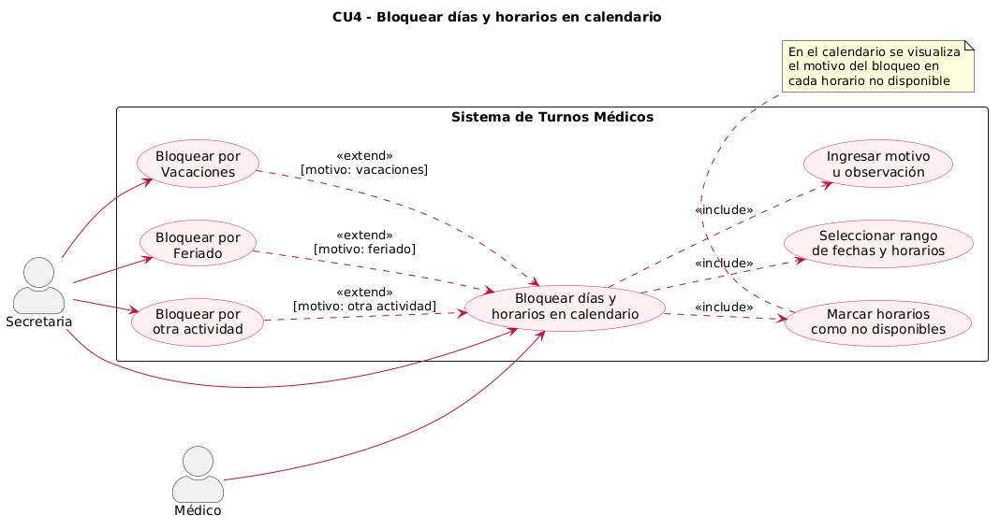
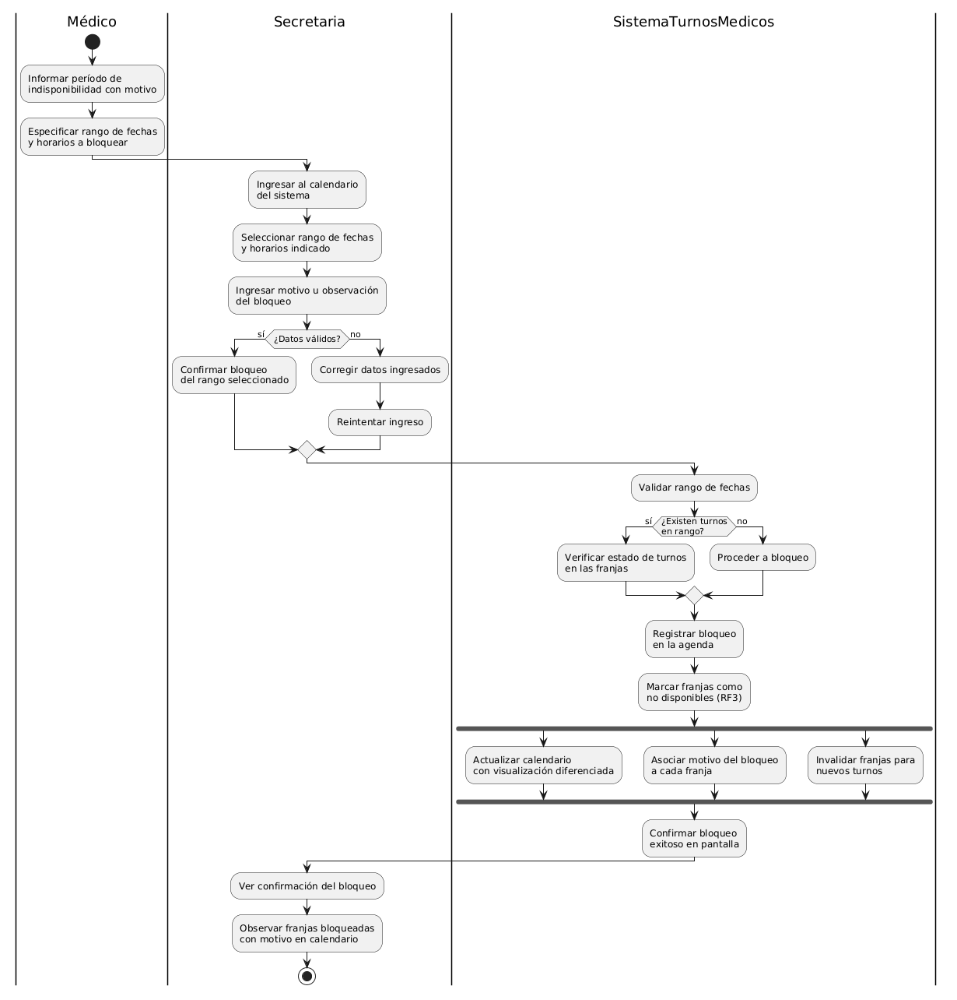
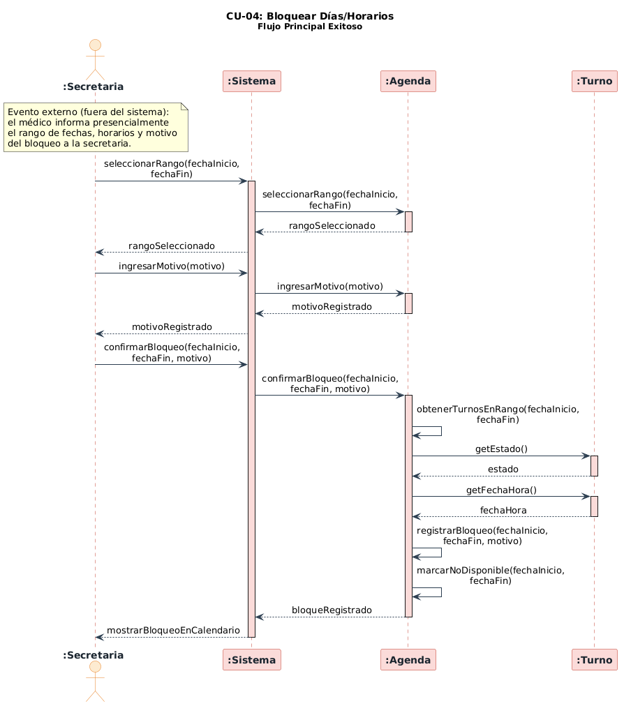
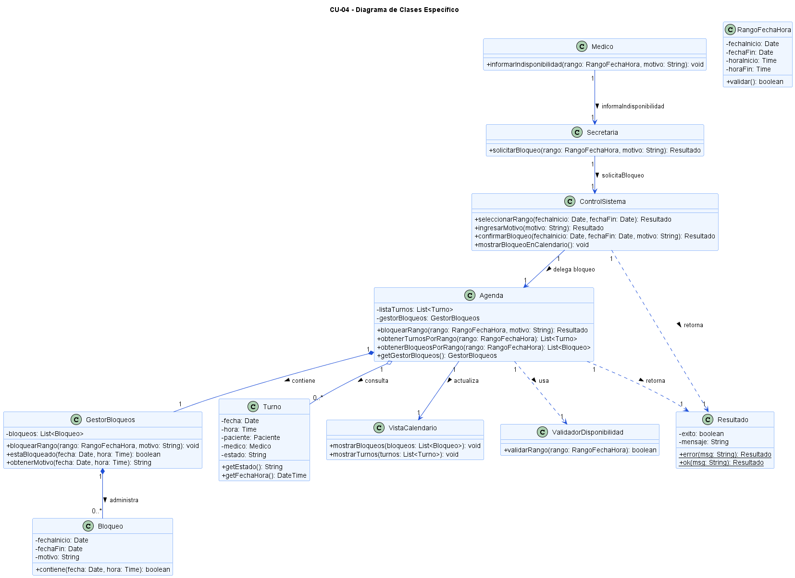

# CU-04: Bloquear días/horarios en calendario

## 1. Descripción y trazabilidad con requisitos funcionales de A1
El caso de uso CU-04 permite que la secretaria registre en el calendario médico un rango de fechas y horarios como no disponibles, junto con el motivo del bloqueo (vacaciones, feriado u otra actividad del médico). El objetivo es que esas franjas queden inhabilitadas para nuevos turnos y que el motivo quede visible en la agenda.

### Trazabilidad con requisitos de A1
- **RF3**: El sistema bloquea horarios ya asignados o no disponibles y evita solapamientos al marcar las franjas como no disponibles.
- **RF4**: Solo un usuario con rol Secretaría puede gestionar el bloqueo; el médico autoriza y explica el intervalo a bloquear.
- **RF5**: El sistema debe conocer las restricciones específicas de días y horarios del consultorio cuando valida rangos de bloqueo.
- **RF6**: El bloqueo se aplica dentro de los horarios habilitados definidos para la agenda (Lun-Vie 9-13 y 15-19, sábados ocasionales).
- **RNF5**: La agenda es el componente centralizado que controla la gestión de los turnos y los bloqueos.

## 2. Diagrama de casos de uso de A2


El diagrama muestra a la Secretaria y al Médico como actores del caso de uso. Incluye los subcasos de selección del rango de fechas, ingreso del motivo y marcado de horarios como no disponibles, garantizando que el motivo quede asociado a cada bloqueo.

## 3. Diagrama de actividades de A3


El diagrama de actividades refleja el flujo principal con las swimlanes de Médico, Secretaria y Sistema. El proceso valida datos, verifica si existen turnos en el rango, registra el bloqueo con GestorBloqueos y actualiza la agenda con franjas no disponibles.

## 4. Diagrama de secuencia de A3


El diagrama de secuencia describe la interacción entre Secretaria, Sistema, Agenda y Turno. Muestra la confirmación de bloqueo, la verificación de turnos existentes en el rango y la notificación al usuario de que la franja quedó bloqueada.

## 5. Diagrama de clases específico



Este diseño enfatiza que la `Agenda` centraliza la gestión de bloqueos y turnos, mientras que `GestorBloqueos` almacena los rangos bloqueados y `VistaCalendario` presenta el estado actualizado. La `Secretaria` interactúa con la `Agenda`; el `Médico` provee la información del bloqueo.

## 6. Coherencia con tarjetas CRC

### Clases involucradas:

| Clase | Responsabilidad (según tarjeta CRC) | Tarjeta CRC |
|---|---|---|
| Secretaria | Gestionar agenda y operaciones administrativas relacionadas con los turnos | [05-tarjeta-crc-secretaria.md](../../herramientas-agile/tarjetas-crc/05-tarjeta-crc-secretaria.md) |
| Medico | Definir disponibilidad y restricciones para la atención médica | [02-tarjeta-crc-medico.md](../../herramientas-agile/tarjetas-crc/02-tarjeta-crc-medico.md) |
| Agenda | Gestionar disponibilidad, turnos y bloqueos de horarios | [04-tarjeta-crc-agenda.md](../../herramientas-agile/tarjetas-crc/04-tarjeta-crc-agenda.md) |
| Turno | Mantener la información correspondiente a fecha, hora y estado del turno | [03-tarjeta-crc-turno.md](../../herramientas-agile/tarjetas-crc/03-tarjeta-crc-turno.md) |
| ControlSistema | Coordinar las operaciones entre los usuarios y los componentes del sistema | [08-tarjeta-crc-control-sistemas.md](../../herramientas-agile/tarjetas-crc/08-tarjeta-crc-control-sistemas.md) |
| VistaCalendario | Presentar la información de agenda, disponibilidad y bloqueos | [10-tarjeta-crc-vista-calendario.md](../../herramientas-agile/tarjetas-crc/10-tarjeta-crc-vista-calendario.md) |
| GestorBloqueos | Almacenar y administrar la colección de bloqueos registrados en la agenda | [11-tarjeta-crc-gestor-bloqueos.md](../../herramientas-agile/tarjetas-crc/11-tarjeta-crc-gestor-bloqueos.md) |
| ValidadorDisponibilidad | Verificar que el rango solicitado se encuentre dentro de los horarios habilitados del consultorio | [12-tarjeta-crc-validador-disponibilidad.md](../../herramientas-agile/tarjetas-crc/12-tarjeta-crc-validador-disponibilidad.md) |
| Bloqueo | Representar un período inhabilitado con su rango de fechas y el motivo asociado | [13-tarjeta-crc-bloqueo.md](../../herramientas-agile/tarjetas-crc/13-tarjeta-crc-bloqueo.md) |
| Resultado | Encapsular el resultado de una operación indicando éxito o error con su mensaje | [14-tarjeta-crc-resultado.md](../../herramientas-agile/tarjetas-crc/14-tarjeta-crc-resultado.md) |
| RangoFechaHora | Encapsular el intervalo de fechas y horarios que define el período a bloquear | [15-tarjeta-crc-rango-fecha-hora.md](../../herramientas-agile/tarjetas-crc/15-tarjeta-crc-rango-fecha-hora.md)|

### Relaciones UML:

| Relación | Clases | Justificación |
|---|---|---|
| Asociación | Medico → Secretaria | El Médico informa a la Secretaria el intervalo no disponible que debe bloquearse en la agenda. |
| Asociación | Secretaria → ControlSistema | La Secretaria delega la solicitud de bloqueo a ControlSistema, que coordina la operación con los componentes del dominio. |
| Asociación | ControlSistema → Agenda | ControlSistema delega a Agenda la ejecución del bloqueo y la consulta de turnos existentes en el rango. |
| Asociación | Agenda → GestorBloqueos | Agenda posee su propio GestorBloqueos como atributo y lo utiliza para registrar y recuperar los períodos bloqueados. |
| Asociación | Agenda → Turno | Agenda consulta los turnos registrados para detectar conflictos dentro del rango a bloquear. |
| Dependencia | Agenda → ValidadorDisponibilidad | Agenda usa ValidadorDisponibilidad para verificar que el rango solicitado esté dentro de los horarios habilitados del consultorio. |
| Dependencia | Agenda → VistaCalendario | Agenda provee la información actualizada de bloqueos a VistaCalendario para su presentación en pantalla. |
| Dependencia | Agenda → Resultado | Las operaciones de Agenda retornan objetos Resultado para indicar éxito o error al componente solicitante. |
| Asociación | GestorBloqueos → Bloqueo | GestorBloqueos administra una colección de objetos Bloqueo que representan los períodos inhabilitados registrados. |
| Dependencia | ControlSistema → VistaCalendario | ControlSistema invoca operaciones de VistaCalendario para presentar el estado actualizado del calendario. |
| Dependencia | ControlSistema → Resultado | Las operaciones ejecutadas por ControlSistema retornan objetos Resultado indicando el estado de la operación. |
| Dependencia | Secretaria → RangoFechaHora | La Secretaria utiliza RangoFechaHora como parámetro para encapsular el intervalo de fechas y horarios del bloqueo. |

## 7. Pseudocódigo orientado a objetos
``` 
INICIO CU-04 Bloquear días/horarios en calendario

// Evento externo:
// El médico informa presencialmente a la secretaria el período
// en el que no estará disponible y el motivo del bloqueo.

// La secretaria selecciona en el sistema el rango de fechas
// que deberá quedar bloqueado.

ControlSistema.seleccionarRango(fechaInicio, fechaFin)


// Agenda recibe el rango solicitado para preparar
// la operación de bloqueo.

Agenda.seleccionarRango(fechaInicio, fechaFin)

retornar rangoSeleccionado


// El sistema informa a la secretaria que el rango fue registrado.

mostrar rangoSeleccionado a Secretaria

// La secretaria ingresa el motivo asociado al bloqueo.

ControlSistema.ingresarMotivo(motivo)


// Agenda registra el motivo que quedará asociado
// a la indisponibilidad del médico.

Agenda.ingresarMotivo(motivo)

retornar motivoRegistrado


// El sistema confirma que el motivo fue incorporado.

mostrar motivoRegistrado a Secretaria

// La secretaria confirma la operación de bloqueo.

ControlSistema.confirmarBloqueo(fechaInicio, fechaFin, motivo)


// Agenda analiza los turnos existentes dentro
// del período para conocer qué reservas se encuentran
// afectadas por la indisponibilidad.

Agenda.obtenerTurnosEnRango(fechaInicio, fechaFin)

    // Por cada turno encontrado se consulta su estado.

    Turno.getEstado()

    // También se recupera la fecha y hora de cada turno
    // comprendido dentro del rango solicitado.

    Turno.getFechaHora()


// Una vez analizada la información existente,
// Agenda registra el período como bloqueado.

Agenda.registrarBloqueo(fechaInicio, fechaFin, motivo)


// La agenda marca el rango completo como no disponible
// para impedir nuevas asignaciones de turnos.

Agenda.marcarNoDisponible(fechaInicio, fechaFin)

retornar bloqueoRegistrado


// Agenda informa al sistema que el bloqueo fue registrado.

mostrar bloqueoRegistrado

// El sistema actualiza la vista para que la secretaria
// pueda visualizar la indisponibilidad registrada.

ControlSistema.mostrarBloqueoEnCalendario()

// Estado final del sistema:
//
// - El rango indicado quedó registrado como bloqueado.
// - El motivo quedó asociado al bloqueo.
// - Las franjas comprendidas en el período aparecen
//   como no disponibles.
// - No podrán asignarse nuevos turnos dentro del rango (RF3).
// - El bloqueo queda visible en el calendario.
// - La agenda mantiene centralizada la gestión de turnos
//   y bloqueos (RNF5).

Retornar "Bloqueo registrado exitosamente"

FIN CU-04
``` 
El pseudocódigo define la responsabilidad de cada objeto: la `Secretaria` inicia el bloqueo delegando a `ControlSistema`, el `ControlSistema` coordina la operación con `Agenda`, `Agenda` valida la disponibilidad a través de `ValidadorDisponibilidad` y delega el registro a `GestorBloqueos`, mientras que `VistaCalendario` actualiza la presentación con las franjas bloqueadas. Se han incluido las clases de soporte `Resultado` y `ValidadorDisponibilidad` para completar la coherencia entre diagrama y especificación.