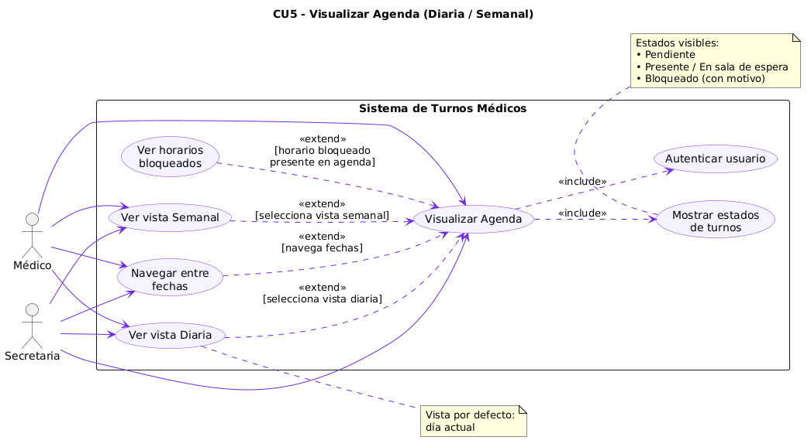
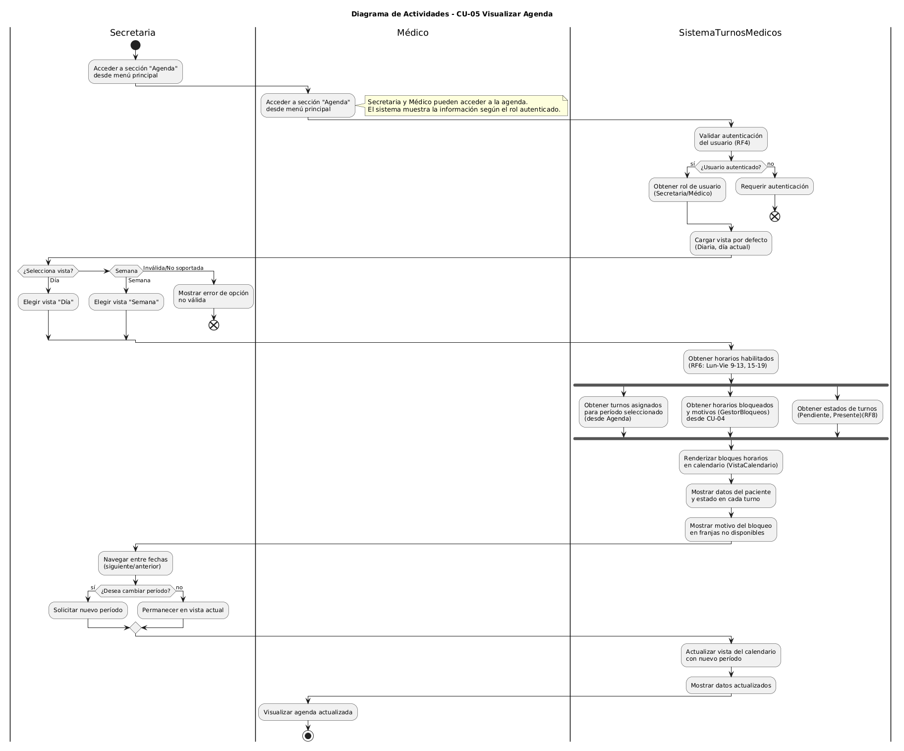
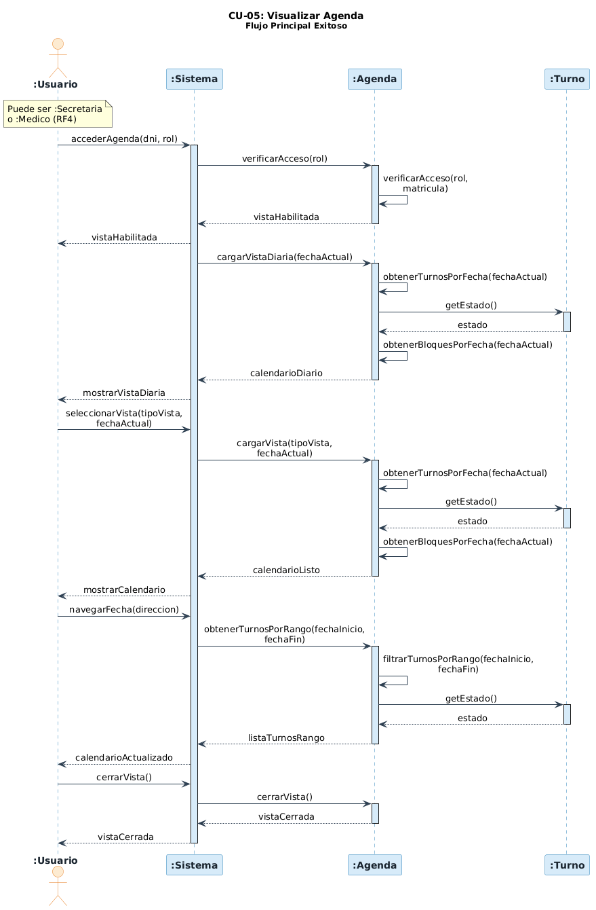
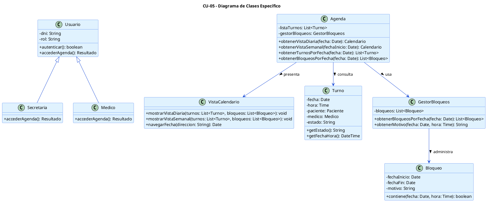

# CU-05: Visualizar agenda (Diaria/Semanal)

## 1. Descripción y trazabilidad con requisitos funcionales de A1
El caso de uso CU-05 permite que la secretaria y el médico consulten la agenda de turnos en una vista diaria o semanal. El sistema debe mostrar los estados de cada turno, los horarios bloqueados con su motivo y permitir la navegación entre fechas sin modificar los datos.

### Trazabilidad con requisitos de A1
- **RF1**: La agenda debe presentar un calendario semanal con opción de vista diaria.
- **RF4**: El acceso está restringido a usuarios autenticados con rol Secretaria o Médico.
- **RF6**: La vista respeta los horarios habilitados del consultorio y muestra los bloques de cada día.
- **RF8**: El sistema muestra el estado de los turnos, incluyendo "Pendiente" y "Presente".
- **RNF5**: La agenda actúa como el único componente centralizado para controlar la visualización de los turnos.

## 2. Diagrama de casos de uso de A2


El diagrama de casos de uso muestra a Secretaria y Médico accediendo a la agenda, seleccionando vista diaria o semanal, navegando fechas y observando horarios bloqueados y estados de turnos.

## 3. Diagrama de actividades de A3


El diagrama de actividades describe la validación de autenticación, la carga de la vista diaria por defecto, la obtención de turnos y bloqueos, y la renderización del calendario con los estados y motivos.

## 4. Diagrama de secuencia de A3


El diagrama de secuencia muestra la interacción de Usuario, Sistema, Agenda y Turno al acceder a la agenda, cargar la vista diaria y navegar entre fechas.

## 5. Diagrama de clases específico
El diagrama de clases específico para CU-05 se diseñó en PlantUML y está disponible en `diagramas/01-diagrama-clases/05-clase-visualizar-agenda.puml`.



El diagrama muestra que `Agenda` es el componente central para recuperar turnos y bloqueos. `VistaCalendario` es responsable de presentar la información en modo diario o semanal, mientras que `Usuario` determina el acceso autorizado.

## 6. Coherencia con tarjetas CRC
- La tarjeta CRC de `Secretaria` define su responsabilidad de "Consultar disponibilidad" y "Gestionar agenda", lo cual valida su rol en CU-05.
- La tarjeta CRC de `Agenda` describe su capacidad de "Mostrar turnos disponibles" y "Gestionar disponibilidad", lo que coincide con la recuperación de turnos y bloqueos para la vista.
- La tarjeta CRC de `Turno` refuerza que cada turno aporta un estado visible y una fecha/hora, necesario para la visualización correcta de la agenda.

## 7. Pseudocódigo orientado a objetos
```pseudo
class Usuario {
    autenticar(): boolean
    accederAgenda(tipoVista, fechaActual): Resultado {
        if not self.autenticar() then
            return Resultado.error("Acceso denegado")
        return Agenda.instancia().mostrarAgenda(tipoVista, fechaActual)
    }
}

class Agenda {
    mostrarAgenda(tipoVista, fechaActual): Resultado {
        turnos = self.obtenerTurnosPorFecha(fechaActual)
        bloqueos = self.gestorBloqueos.obtenerBloqueosPorFecha(fechaActual)
        if tipoVista == "diaria" then
            VistaCalendario.instancia().mostrarVistaDiaria(turnos, bloqueos)
        else
            calendario = self.calcularRangoSemanal(fechaActual)
            turnos = self.obtenerTurnosPorRango(calendario.fechaInicio, calendario.fechaFin)
            bloqueos = self.gestorBloqueos.obtenerBloqueosPorRango(calendario.fechaInicio, calendario.fechaFin)
            VistaCalendario.instancia().mostrarVistaSemanal(turnos, bloqueos)
        return Resultado.ok("Agenda mostrada")
    }
}

class VistaCalendario {
    mostrarVistaDiaria(turnos, bloqueos): void {
        renderizarBloques(turnos)
        renderizarBloqueos(bloqueos)
    }
    mostrarVistaSemanal(turnos, bloqueos): void {
        renderizarBloques(turnos)
        renderizarBloqueos(bloqueos)
    }
}

class GestorBloqueos {
    obtenerBloqueosPorFecha(fecha): List<Bloqueo> {
        return bloqueos.filtrar(b => b.contiene(fecha, cualquierHora))
    }
}
```

El pseudocódigo muestra cómo un `Usuario` autenticado solicita la visualización de la agenda, cómo `Agenda` reúne los turnos y bloqueos correspondientes y cómo `VistaCalendario` presenta la información en la vista solicitada.
