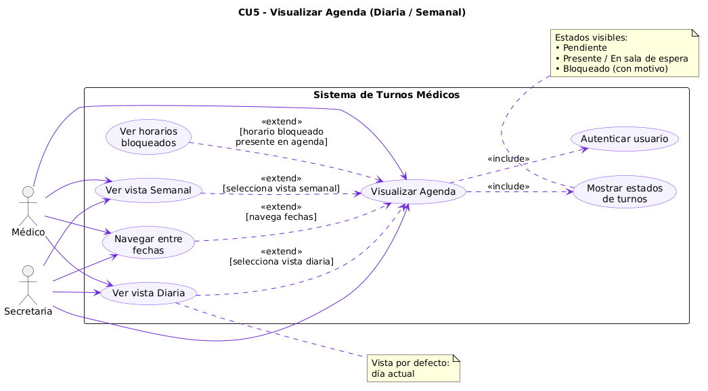
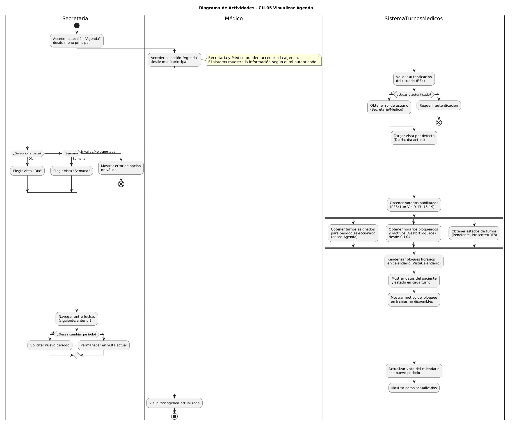
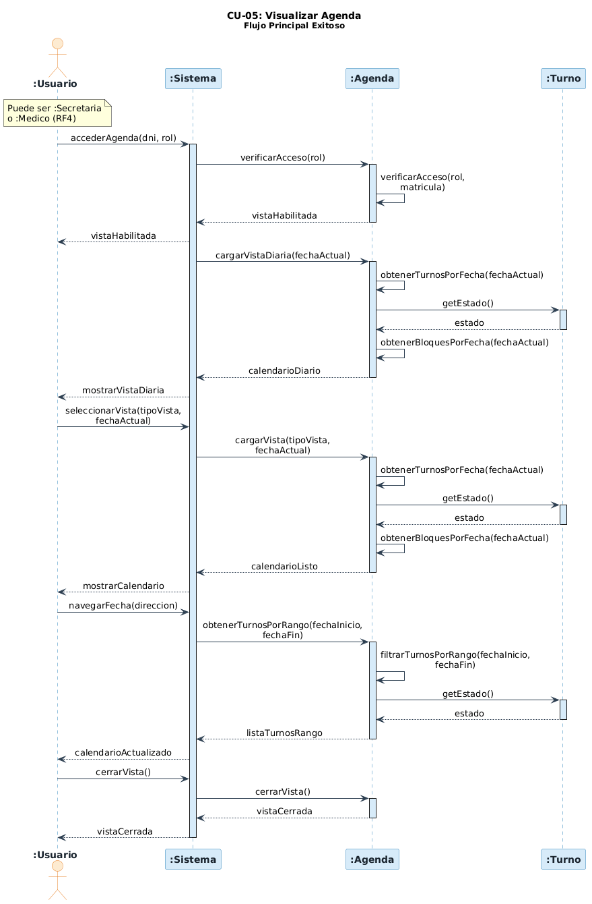
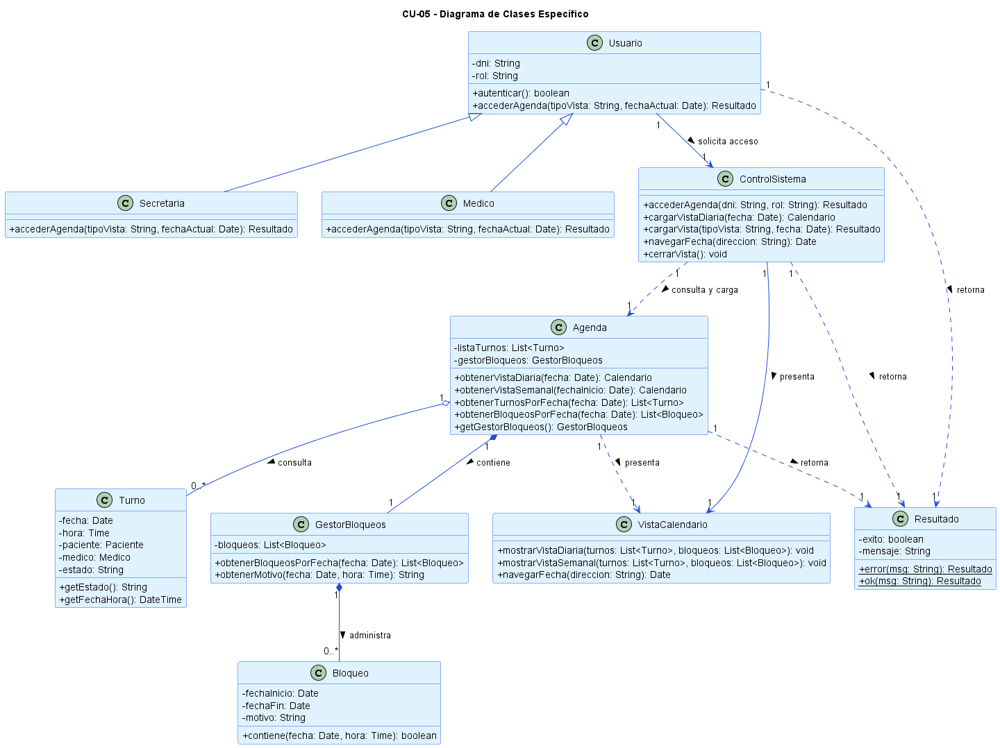

# CU-05: Visualizar agenda (Diaria/Semanal)

## 1. Descripción y trazabilidad con requisitos funcionales de A1
El caso de uso CU-05 permite que la secretaria y el médico consulten la agenda de turnos en una vista diaria o semanal. El sistema debe mostrar los estados de cada turno, los horarios bloqueados con su motivo y permitir la navegación entre fechas sin modificar los datos.

### Trazabilidad con requisitos de A1
- **RF1**: La agenda debe presentar un calendario semanal con opción de vista diaria.
- **RF4**: El acceso está restringido a usuarios autenticados con rol Secretaria o Médico.
- **RF6**: La vista respeta los horarios habilitados del consultorio y muestra los bloques de cada día.
- **RF8**: El sistema muestra el estado de los turnos, incluyendo "Pendiente" y "Presente".
- **RNF5**: La agenda actúa como el único componente centralizado para controlar la visualización de los turnos.

## 2. Diagrama de casos de uso de A2


El diagrama de casos de uso muestra a Secretaria y Médico accediendo a la agenda, seleccionando vista diaria o semanal, navegando fechas y observando horarios bloqueados y estados de turnos.

## 3. Diagrama de actividades de A3


El diagrama de actividades describe la validación de autenticación, la carga de la vista diaria por defecto, la obtención de turnos y bloqueos, y la renderización del calendario con los estados y motivos.

## 4. Diagrama de secuencia de A3


El diagrama de secuencia muestra la interacción de Usuario, Sistema, Agenda y Turno al acceder a la agenda, cargar la vista diaria y navegar entre fechas.

## 5. Diagrama de clases específico



El diagrama muestra que `Agenda` es el componente central para recuperar turnos y bloqueos. `VistaCalendario` es responsable de presentar la información en modo diario o semanal, mientras que `Usuario` determina el acceso autorizado.

## 6. Coherencia con tarjetas CRC

### Clases involucradas

| Clase | Responsabilidad (según tarjeta CRC) | Tarjeta CRC |
|---------|--------------------------------------|-------------|
| Secretaria | Gestionar agenda y consultar disponibilidad | [05-tarjeta-crc-secretaria.md](../../herramientas-agile/tarjetas-crc/05-tarjeta-crc-secretaria.md)|
| Medico | Gestionar disponibilidad y consultar agenda médica | [02-tarjeta-crc-medico.md](../../herramientas-agile/tarjetas-crc/02-tarjeta-crc-medico.md) |
| Agenda | Gestionar disponibilidad y presentar información de turnos | [04-tarjeta-crc-agenda.md](../../herramientas-agile/tarjetas-crc/04-tarjeta-crc-agenda.md) |
| Turno | Mantener la información de fecha, hora y estado de los turnos | [03-tarjeta-crc-turno.md](../../herramientas-agile/tarjetas-crc/03-tarjeta-crc-turno.md)|
| ControlSistema | Coordinar las operaciones entre usuarios y componentes del sistema | [08-tarjeta-crc-control-sistema.md](../../herramientas-agile/tarjetas-crc/08-tarjeta-crc-control-sistemas.md) |
| VistaCalendario | Mostrar información de agenda, turnos y bloqueos | [10-tarjeta-crc-vista-calendario.md](../../herramientas-agile/tarjetas-crc/10-tarjeta-crc-vista-calendario.md) |
| GestorBloqueos | Almacenar y administrar la colección de bloqueos registrados en la agenda | [11-tarjeta-crc-gestor-bloqueos.md](../../herramientas-agile/tarjetas-crc/11-tarjeta-crc-gestor-bloqueos.md) |
| Bloqueo | Representar un período inhabilitado con su rango de fechas y el motivo asociado | [13-tarjeta-crc-bloqueo.md](../../herramientas-agile/tarjetas-crc/13-tarjeta-crc-bloqueo.md) |
| Resultado | Encapsular el resultado de una operación indicando éxito o error con su mensaje | [14-tarjeta-crc-resultado.md](../../herramientas-agile/tarjetas-crc/14-tarjeta-crc-resultado.md) |

### Relaciones UML

| Relación | Clases | Justificación |
|-----------|---------|--------------|
| Generalización | Secretaria → Usuario | La Secretaria hereda de Usuario los atributos y operaciones comunes de autenticación y acceso a la agenda. |
| Generalización | Medico → Usuario | El Médico hereda de Usuario los atributos y operaciones comunes del sistema. |
| Asociación | Usuario → ControlSistema | El Usuario interactúa con el sistema a través de ControlSistema para acceder a la agenda y solicitar distintas vistas. |
| Asociación | ControlSistema → Agenda | ControlSistema consulta la Agenda para recuperar la información necesaria para construir la vista solicitada. |
| Asociación | Agenda → Turno | Agenda obtiene los turnos correspondientes a una fecha o rango de fechas para su visualización. |
| Asociación | Agenda → GestorBloqueos | Agenda utiliza GestorBloqueos para recuperar los bloqueos registrados que deben mostrarse en la vista. |
| Asociación | GestorBloqueos → Bloqueo | GestorBloqueos administra una colección de bloqueos que representan períodos no disponibles. |
| Asociación | Agenda → VistaCalendario | Agenda suministra la información de turnos y bloqueos que será presentada en la interfaz. |
| Dependencia | ControlSistema → VistaCalendario | ControlSistema solicita la renderización de la vista diaria o semanal. |
| Dependencia | ControlSistema → Resultado | Las operaciones realizadas retornan objetos Resultado indicando éxito o error. |
| Dependencia | Usuario → Resultado | Las operaciones iniciadas por el Usuario retornan un objeto Resultado. |

## 7. Pseudocódigo orientado a objetos
``` 
INICIO CU-05 Visualizar Agenda

// La secretaria o el médico solicitan acceder a la agenda
// para consultar los turnos programados y los períodos
// que se encuentran bloqueados.

Usuario.accederAgenda(tipoVista, fechaActual)

    // El sistema verifica que el usuario posea
    // credenciales válidas para acceder a la agenda.

    Usuario.autenticar()

    // Una vez autenticado, ControlSistema valida
    // que el rol corresponda a Secretaría o Médico.

    ControlSistema.accederAgenda(dni, rol)


// El sistema habilita el acceso a la agenda.

mostrar "Vista habilitada" a Usuario


// Inicialmente se carga la información correspondiente
// a la fecha actual.

Calendario calendario =
    ControlSistema.cargarVistaDiaria(fechaActual)

    // Agenda recupera todos los turnos registrados
    // para la fecha solicitada.

    List<Turno> turnos =
        Agenda.obtenerTurnosPorFecha(fechaActual)

        // De cada turno se consulta su estado para
        // informar correctamente la situación de la agenda.

        Turno.getEstado()


    // Agenda recupera también los períodos bloqueados
    // registrados para esa fecha.

    GestorBloqueos gestor =
        Agenda.getGestorBloqueos()

    List<Bloqueo> bloqueos =
        gestor.obtenerBloqueosPorFecha(fechaActual)


    // Para cada bloqueo se recupera el motivo
    // que justifica la indisponibilidad.

    gestor.obtenerMotivo(fechaActual, hora)


    // Agenda construye la vista diaria con toda
    // la información disponible.

    Agenda.obtenerVistaDiaria(fechaActual)


// El sistema presenta la agenda diaria mostrando
// turnos y bloqueos.

VistaCalendario.mostrarVistaDiaria(turnos, bloqueos)


// El usuario puede solicitar otra vista del calendario,
// por ejemplo una vista semanal.

ControlSistema.cargarVista(tipoVista, fechaActual)

    // Agenda obtiene la información necesaria
    // para construir la vista solicitada.

    Agenda.obtenerVistaSemanal(fechaActual)


// El sistema presenta la información en la vista elegida.

VistaCalendario.mostrarVistaSemanal(turnos, bloqueos)


// El usuario puede desplazarse entre fechas para
// consultar períodos anteriores o futuros.

ControlSistema.navegarFecha(direccion)

    VistaCalendario.navegarFecha(direccion)


// La agenda se actualiza para reflejar la nueva fecha.

mostrar "Calendario actualizado" a Usuario


// Cuando finaliza la consulta, el usuario cierra la agenda.

ControlSistema.cerrarVista()


// Estado final del sistema:
//
// - El usuario accedió a la agenda con permisos válidos.
// - Se visualizaron los turnos registrados.
// - Se visualizaron los períodos bloqueados y sus motivos.
// - Fue posible alternar entre vistas de calendario.
// - Fue posible navegar entre fechas.
// - No se modificó información de turnos ni bloqueos.
// - La Agenda centralizó la consulta de información (RNF5).

Retornar "Visualización finalizada"

FIN CU-05
``` 
El pseudocódigo muestra cómo un Usuario autenticado delega la solicitud de visualización en ControlSistema, que actúa como mediador hacia Agenda. Luego Agenda reúne los turnos y bloqueos correspondientes y VistaCalendario presenta la información en la vista solicitada.