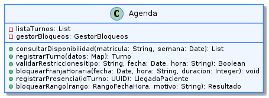

# Abstracción 
---

La **abstracción** consiste en representar únicamente los aspectos relevantes de un concepto del dominio, ocultando la complejidad interna de su implementación y exponiendo una interfaz simplificada que las demás clases pueden utilizar sin necesidad de conocer los detalles internos.

En la programación orientada a objetos, la abstracción consiste en representar una clase por sus características y comportamientos esenciales, dejando de lado los detalles innecesarios. Las clases abstractas y las interfaces permiten definir el comportamiento esperado de un conjunto de objetos.

La abstracción favorece el principio Open/Closed (OCP), ya que las interfaces y clases abstractas definen un contrato que permite incorporar nuevas implementaciones sin modificar el código existente.

Entre los patrones de diseño, Strategy es uno de los que mejor representa este concepto, ya que define una interfaz que abstrae un comportamiento y permite utilizar distintas implementaciones concretas de forma intercambiable. De esta manera, el cliente interactúa con la abstracción sin depender de una implementación específica.

---

## Ejemplo en el proyecto

La clase Agenda abstrae la gestión de la disponibilidad horaria del sistema. Las clases colaboradoras solo utilizan las operaciones que expone Agenda, mientras que la interacción con componentes como GestorBloqueos, Turno y LlegadaPaciente queda encapsulada dentro de esta clase.



> Ver diagrama completo en: [abstraccion-ejemplo](../../diagramas\01-diagrama-clases\capturas-pilares\poo-abstraccion-ejemplo-1.png)

**Descripción del diagrama:** El fragmento muestra a `Agenda` exponiendo únicamente su interfaz pública: `consultarDisponibilidad()`, `registrarTurno()`, `bloquearRango()`, `registrarPresencia()`, entre otros. Los atributos internos —`listaTurnos`, `gestorBloqueos`— son privados e inaccesibles directamente desde afuera. Ninguna clase colaboradora puede ver ni manipular la estructura interna de `Agenda`.

**Justificación técnica:** `Agenda` cumple el principio de abstracción porque separa el *contrato de negocio* (qué operaciones provee) de la *implementación* (cómo coordina sus colaboradores internos). `ControlSistema`, `Secretaria` y `Medico` invocan `agenda.bloquearRango(rango, motivo)` sin saber que esa operación dispara internamente `gestorBloqueos.bloquearRango()`, valida solapamientos en `ValidadorDisponibilidad` y devuelve un `Resultado`.

---

## Ejemplo de Código

El siguiente fragmento en Java ilustra cómo `ControlSistema` usa la abstracción de `Agenda` para ejecutar el flujo de check-in sin conocer ningún detalle interno de su implementación.

```java
public class ControlSistema {

    private Agenda agenda;

    public ControlSistema(Agenda agenda) {
        this.agenda = agenda;
    }

    public void registrarPresencia(Turno turno) {
        agenda.registrarPresencia(turno.getId());
        agenda.cancelarRecordatoriosPendientes(turno.getId());
    }
}

public class Agenda {

    public void registrarPresencia(UUID idTurno) {
        // Lógica interna para registrar la presencia
    }

    public void cancelarRecordatoriosPendientes(UUID idTurno) {
        // Lógica interna para cancelar recordatorios
    }
}

```

**Justificación técnica del código:**

ControlSistema utiliza los métodos públicos de Agenda para registrar la presencia de un paciente, sin conocer cómo se realiza esa tarea internamente. Agenda oculta los detalles de implementación y expone únicamente las operaciones necesarias, representando así el principio de abstracción.
