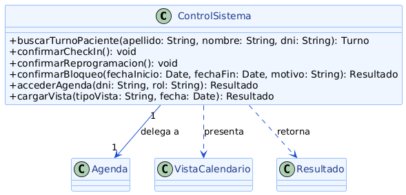

# Abstracción
---

La **abstracción** consiste en modelar una clase a partir de lo esencial que necesita el resto del sistema, dejando fuera de su interfaz pública los detalles de cómo resuelve internamente esa responsabilidad. Quien usa la clase conoce *qué* puede pedirle, pero no *cómo* lo hace por dentro, ni con qué otros objetos colabora para lograrlo.

En el diseño orientado a objetos, la abstracción se materializa frecuentemente en clases que actúan como punto de entrada de un subsistema: ofrecen un pequeño conjunto de operaciones de alto nivel y, por detrás, coordinan a varios colaboradores para resolverlas. Quien consume esa clase no necesita conocer cuántos objetos intervienen ni en qué orden se comunican entre sí; solo necesita conocer el contrato simplificado.

La abstracción está estrechamente relacionada con el principio de Responsabilidad Única (SRP), porque una interfaz bien abstraída agrupa operaciones que responden a una misma intención, y con el principio Open/Closed (OCP), porque la forma en que se resuelve esa abstracción puede cambiar internamente sin afectar a quienes ya la consumen. En cuanto a los patrones de diseño del proyecto, el patrón Factory Method se apoya directamente en la abstracción: el cliente solicita un objeto a través de un método de fábrica y recibe una instancia sin conocer la clase concreta ni el proceso de construcción que hay detrás.

---

## Ejemplo en el proyecto

La clase `ControlSistema` abstrae toda la coordinación necesaria para atender una acción del usuario. Expone operaciones simples como `confirmarCheckIn()`, `confirmarBloqueo()` o `accederAgenda()`, pero por detrás delega en `Agenda`, se apoya en `VistaCalendario` para presentar resultados y retorna objetos `Resultado` como respuesta uniforme.



> Ver diagrama completo en: [poo-abstraccion-alan.png](../../diagramas/01-diagrama-clases/capturas-pilares/poo-abstraccion-alan.png)

**Descripción del diagrama:** `ControlSistema` expone hacia `Secretaria` y `Medico` operaciones como `buscarTurnoPaciente()`, `confirmarCheckIn()`, `confirmarReprogramacion()`, `confirmarBloqueo()`, `accederAgenda()` y `cargarVista()`. Internamente delega la ejecución real en `Agenda` (relación *"delega a"*), utiliza `VistaCalendario` para mostrar la información (*"presenta"*) y devuelve siempre un `Resultado` (*"retorna"*). Ninguno de esos tres colaboradores es visible para quien invoca a `ControlSistema`.

**Justificación técnica:** cuando una `Secretaria` quiere bloquear un rango horario, solo llama a `controlSistema.confirmarBloqueo(fechaInicio, fechaFin, motivo)`. No sabe que por detrás `ControlSistema` le delega el pedido a `Agenda`, que a su vez coordina a `GestorBloqueos` y a `ValidadorDisponibilidad` antes de construir un `Resultado`. Toda esa cadena de colaboración —cuántos objetos intervienen y en qué orden— queda completamente abstraída detrás de una única operación. Esto es distinto de simplemente ocultar atributos privados: acá lo que se abstrae es la *complejidad de la coordinación*, no solamente el estado de un objeto.

---

## Ejemplo de Código

El siguiente fragmento en Java muestra cómo `ControlSistema` abstrae la coordinación entre `Agenda` y `VistaCalendario` detrás de una única operación pública.

```java
public class ControlSistema {

    private Agenda agenda;

    public ControlSistema(Agenda agenda) {
        this.agenda = agenda;
    }

    public Resultado confirmarBloqueo(Date fechaInicio, Date fechaFin, String motivo) {
        RangoFechaHora rango = new RangoFechaHora(fechaInicio, fechaFin);
        Resultado resultado = agenda.bloquearRango(rango, motivo);

        VistaCalendario vista = agenda.obtenerVistaDiaria(fechaInicio);
        vista.mostrarBloqueos(agenda.getGestorBloqueos().obtenerBloqueosPorFecha(fechaInicio));

        return resultado;
    }
}
```

**Justificación técnica del código:**

Quien invoca `controlSistema.confirmarBloqueo(fechaInicio, fechaFin, motivo)` recibe un `Resultado` sin necesidad de saber que, para producirlo, `ControlSistema` tuvo que construir un `RangoFechaHora`, pedirle a `Agenda` que valide y registre el bloqueo, y luego actualizar la vista a través de `VistaCalendario`. Si mañana se agrega un paso adicional a ese flujo —por ejemplo, notificar a los pacientes con turnos afectados—, `confirmarBloqueo()` puede modificarse internamente sin que el código que lo invoca deba cambiar una sola línea, porque solo conoce la abstracción, no su implementación.
