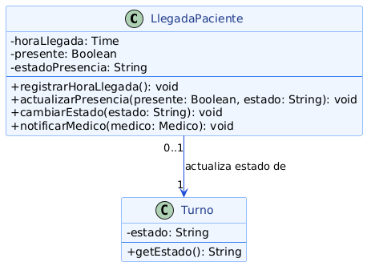

# Encapsulamiento
---

El **encapsulamiento** consiste en agrupar el estado y el comportamiento de una entidad dentro de una misma clase, restringiendo el acceso directo a sus atributos y obligando a que cualquier modificación pase por métodos que puedan validarla. El objetivo es que el objeto sea siempre responsable de mantener su propia consistencia interna.

En la programación orientada a objetos, el encapsulamiento se logra declarando los atributos con visibilidad privada o protegida y exponiendo únicamente los métodos necesarios para leer o modificar ese estado de forma controlada. Sin esta protección, cualquier otra clase podría dejar al objeto en un estado inválido simplemente asignando un valor incorrecto a un atributo.

El encapsulamiento favorece directamente el principio de Responsabilidad Única (SRP), porque concentra en una sola clase la responsabilidad de mantener válido su propio estado, y sostiene el principio Open/Closed (OCP), ya que la representación interna puede modificarse sin romper a las clases que solo dependen de la interfaz pública. En relación con los patrones de diseño del proyecto, el Factory Method encapsula el proceso de construcción del objeto dentro del método de fábrica, de modo que el código cliente nunca manipula directamente los atributos del objeto durante su creación.

---

## Ejemplo en el proyecto

La clase `LlegadaPaciente` encapsula el registro de la llegada de un paciente al consultorio. Sus tres atributos son privados y solo pueden modificarse a través de los métodos que la propia clase define para ese fin.



> Ver diagrama completo en: [poo-encapsulamiento-alan.png](../../diagramas/01-diagrama-clases/capturas-pilares/poo-encapsulamiento-alan.png)

**Descripción del diagrama:** `horaLlegada`, `presente` y `estadoPresencia` tienen visibilidad privada (`-`). El único modo de alterar ese estado es a través de `registrarHoraLlegada()`, `actualizarPresencia(presente, estado)` o `cambiarEstado(estado)`. Además, `LlegadaPaciente` se vincula con `Turno` mediante una asociación *"actualiza estado de"*, lo que indica que es la propia clase, y no un componente externo, quien decide cuándo y cómo reflejar la presencia del paciente sobre el turno correspondiente.

**Justificación técnica:** el registro de la llegada de un paciente tiene reglas que deben cumplirse siempre —por ejemplo, no puede registrarse una hora de llegada dos veces, ni marcarse como "presente" sin una hora de llegada asociada—. Si `horaLlegada` o `presente` fueran atributos públicos, cualquier clase de `Control y Presentación` podría escribir sobre ellos directamente y omitir esas validaciones, dejando el registro en un estado inconsistente con el `Turno` que representa. Al encapsular el estado, `LlegadaPaciente` centraliza esa responsabilidad y cumple el principio SRP.

---

## Ejemplo de Código

El siguiente fragmento en Java muestra cómo `LlegadaPaciente` protege su estado interno y solo permite modificarlo mediante métodos que aplican la validación correspondiente.

```java
public class LlegadaPaciente {

    private Time    horaLlegada;
    private boolean presente;
    private String  estadoPresencia;

    public void registrarHoraLlegada() {
        if (this.horaLlegada != null) {
            throw new IllegalStateException("La llegada ya fue registrada");
        }
        this.horaLlegada = Time.valueOf(LocalTime.now());
        this.estadoPresencia = "En sala de espera";
    }

    public void actualizarPresencia(boolean presente, String estado) {
        if (this.horaLlegada == null) {
            throw new IllegalStateException("No se puede marcar presencia sin llegada registrada");
        }
        this.presente = presente;
        this.estadoPresencia = estado;
    }

    public String getEstadoPresencia() {
        return estadoPresencia;
    }
}
```

**Justificación técnica del código:**

`LlegadaPaciente` no ofrece setters directos para `horaLlegada` ni `presente`. La única forma de registrar una llegada es `registrarHoraLlegada()`, que primero valida que no exista un registro previo, y la única forma de cambiar la presencia es `actualizarPresencia()`, que exige que la llegada ya haya sido registrada. Ninguna clase externa —ni `Agenda`, ni `ControlSistema`— puede alterar ese estado sin pasar por esas reglas, lo que mantiene la coherencia del objeto y aísla el resto del sistema de los detalles de cómo se valida ese ciclo de vida.

El encapsulamiento se ve en tres puntos concretos del código: los tres atributos (`horaLlegada`, `presente`, `estadoPresencia`) están declarados `private`, no accesibles desde fuera de la clase; no existen setters públicos, la única forma de escribir esos atributos es a través de `registrarHoraLlegada()` y `actualizarPresencia()`
