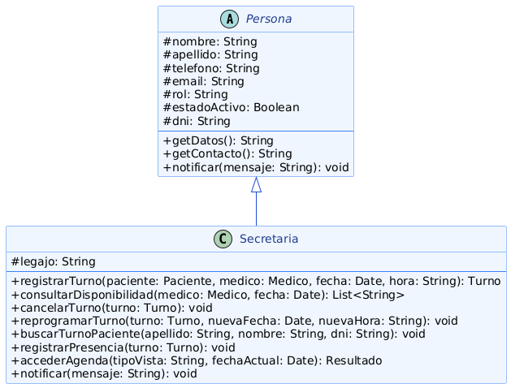

# Herencia
---

La **herencia** es el mecanismo que permite que una clase (subclase) reutilice los atributos y métodos definidos en otra clase (superclase), agregando o especializando el comportamiento propio del rol que representa dentro del dominio.

En la programación orientada a objetos, la herencia cumple dos funciones complementarias: por un lado evita duplicar en cada subclase los atributos y operaciones que son comunes a todas —reduciendo el mantenimiento a un único lugar—; por otro, establece una jerarquía de tipos que habilita el polimorfismo, ya que cualquier subclase puede utilizarse en cualquier contexto donde se espere una instancia de la superclase.

La herencia está directamente vinculada al principio de Sustitución de Liskov (LSP): una subclase debe poder reemplazar a su superclase sin alterar el comportamiento que el resto del sistema espera de ella. También sostiene el principio Open/Closed (OCP), porque agregar un nuevo rol al sistema implica crear una nueva subclase, sin tocar la superclase ni el código que ya depende de ella. En cuanto a los patrones de diseño del proyecto, el Factory Method se apoya en esta jerarquía para devolver instancias concretas de `Persona` —como `Medico`, `Paciente` o `Secretaria`— a través de su tipo base, sin que el código cliente conozca la subclase exacta que recibió.

---

## Ejemplo en el proyecto

La clase abstracta `Persona` define la identidad y el comportamiento común a todos los roles del sistema. `Secretaria` hereda esa base y la especializa con el atributo y las operaciones propias de su función administrativa.



> Ver diagrama completo en: [poo-herencia-alan.png](../../diagramas/01-diagrama-clases/capturas-pilares/poo-herencia-alan.png)

**Descripción del diagrama:** `Persona` define los atributos protegidos `nombre`, `apellido`, `telefono`, `email`, `rol`, `estadoActivo` y `dni`, junto con los métodos `getDatos()`, `getContacto()` y `notificar()`. `Secretaria` hereda todo ese conjunto y agrega su propio atributo `legajo`, además de las operaciones administrativas `registrarTurno()`, `consultarDisponibilidad()`, `cancelarTurno()`, `reprogramarTurno()`, `buscarTurnoPaciente()`, `registrarPresencia()` y `accederAgenda()`.

**Justificación técnica:** la relación es semánticamente correcta porque una secretaria *es* una persona del sistema, con datos de identidad y contacto idénticos a los de cualquier otro rol. Gracias a la herencia, `Persona` centraliza esos atributos comunes una única vez, y tanto `Medico` como `Paciente` como `Secretaria` los reciben sin duplicación. Además, cualquier módulo que trabaje sobre referencias de tipo `Persona` —como el servicio de notificaciones— puede operar sobre una `Secretaria` sin ningún cambio, porque `Secretaria` cumple íntegramente el contrato heredado y solo lo extiende con capacidades administrativas, respetando el principio de Sustitución de Liskov.

---

## Ejemplo de Código

El siguiente fragmento en Java ilustra la jerarquía de herencia entre `Persona` y `Secretaria`, mostrando la reutilización de atributos comunes y la especialización propia del rol.

```java
public abstract class Persona {

    protected String  nombre;
    protected String  apellido;
    protected String  telefono;
    protected String  email;
    protected String  rol;
    protected boolean estadoActivo;
    protected String  dni;

    public Persona(String nombre, String apellido, String telefono, String email, String dni) {
        this.nombre       = nombre;
        this.apellido     = apellido;
        this.telefono     = telefono;
        this.email        = email;
        this.dni          = dni;
        this.estadoActivo = true;
    }

    public String getDatos() {
        return apellido + ", " + nombre + " [DNI: " + dni + "]";
    }

    public String getContacto() {
        return "Tel: " + telefono + " | Email: " + email;
    }

    public abstract void notificar(String mensaje);
}

public class Secretaria extends Persona {

    private String legajo;

    public Secretaria(String nombre, String apellido, String telefono,
                       String email, String dni, String legajo) {
        super(nombre, apellido, telefono, email, dni);
        this.legajo = legajo;
    }

    @Override
    public void notificar(String mensaje) {
        System.out.println("[SISTEMA DE GESTIÓN] " + getDatos() + ": " + mensaje);
    }

    public Turno registrarTurno(Paciente paciente, Medico medico, Date fecha, String hora) {
        // Lógica de registro de turno
        return null;
    }
}
```

**Justificación técnica del código:**

`Secretaria` reutiliza mediante `super(...)` la inicialización de los atributos comunes definidos en `Persona`, evitando repetir esa lógica en cada subclase. A la vez, especializa el comportamiento heredado sobreescribiendo `notificar()` con un canal propio del rol administrativo, y agrega la operación `registrarTurno()`, que no tiene sentido en otros roles como `Medico`. Cualquier código que reciba una referencia de tipo `Persona` puede invocar `getDatos()` o `notificar()` sobre una `Secretaria` sin conocer que se trata de esa subclase específica, cumpliendo el contrato heredado.

La herencia se ve en el código en la declaración `public class Secretaria extends Persona`, que establece la relación de herencia en sí misma; en el uso de `super(nombre, apellido, telefono, email, dni)` dentro del constructor de `Secretaria`, que reutiliza la inicialización de los atributos comunes definidos en `Persona` sin repetir esa lógica; y en el `@Override` sobre `notificar()`, que muestra a `Secretaria` sobreescribiendo un método heredado con su propia implementación.
