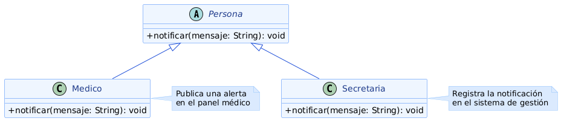

# Polimorfismo
---

El **polimorfismo** permite que distintas subclases respondan de manera diferente a un mismo mensaje, y que el código que las invoca pueda tratarlas de forma uniforme a través de su tipo base, sin necesidad de conocer la clase concreta con la que está trabajando en cada momento.

En la programación orientada a objetos, el polimorfismo se expresa principalmente mediante la sobreescritura de métodos: una superclase declara un método y cada subclase lo implementa según su propia necesidad. En tiempo de ejecución, el lenguaje resuelve automáticamente cuál de esas implementaciones ejecutar, según el tipo real del objeto sobre el que se invoca el mensaje.

El polimorfismo depende directamente del principio de Sustitución de Liskov (LSP), porque solo es seguro tratar de forma uniforme a distintas subclases si todas ellas respetan el contrato de la superclase. A su vez, habilita el principio Open/Closed (OCP): agregar un nuevo rol con un comportamiento distinto no exige modificar el código que ya invoca el método a través del tipo base, solo crear una nueva subclase que lo sobreescriba. En cuanto a los patrones de diseño del proyecto, el Factory Method depende del polimorfismo para que el cliente use el objeto retornado sin conocer su tipo concreto, y el Strategy lo usa como mecanismo central para intercambiar algoritmos sin que el contexto lo note.

---

## Ejemplo en el proyecto

El método `notificar(mensaje: String)`, declarado en `Persona`, está sobreescrito tanto en `Medico` como en `Secretaria`, y cada uno lo resuelve a través de un canal completamente distinto.



> Ver diagrama completo en: [poo-polimorfismo-alan.png](../../diagramas/01-diagrama-clases/capturas-pilares/poo-polimorfismo-alan.png)

**Descripción del diagrama:** `Persona` declara `notificar(mensaje: String): void` sin implementación concreta. `Medico` la sobreescribe para publicar una alerta en su panel médico, mientras que `Secretaria` la sobreescribe para registrar la notificación en el sistema de gestión administrativo. Desde el exterior, ambas subclases responden exactamente a la misma firma: `persona.notificar(mensaje)`.

**Justificación técnica:** cualquier clase del sistema que necesite avisar a un conjunto de personas —por ejemplo ante la reprogramación de un turno— puede recorrer una lista de `Persona` e invocar `notificar()` sobre cada elemento, sin preguntar de qué subclase se trata. El despacho dinámico resuelve en tiempo de ejecución cuál implementación ejecutar según el tipo concreto de cada objeto. Si en el futuro se agrega un nuevo rol —por ejemplo un `Administrador`— con su propio canal de aviso, alcanza con crear la subclase y sobreescribir `notificar()`; el código que dispara las notificaciones no necesita modificarse, lo que evidencia el cumplimiento del principio Open/Closed gracias al polimorfismo.

---

## Ejemplo de Código

El siguiente fragmento en Java muestra el polimorfismo en acción: un servicio recorre una lista de `Persona` e invoca `notificar()` sin distinguir si el objeto es un `Medico` o una `Secretaria`.

```java
public abstract class Persona {

    protected String nombre;
    protected String apellido;

    public abstract void notificar(String mensaje);
}

public class Medico extends Persona {

    @Override
    public void notificar(String mensaje) {
        System.out.println("[PANEL MÉDICO] " + nombre + " " + apellido + ": " + mensaje);
    }
}

public class Secretaria extends Persona {

    @Override
    public void notificar(String mensaje) {
        System.out.println("[SISTEMA DE GESTIÓN] " + nombre + " " + apellido + ": " + mensaje);
    }
}

public class ControlSistema {

    public void avisarCambioTurno(List<Persona> involucrados, String mensaje) {
        for (Persona persona : involucrados) {
            persona.notificar(mensaje);
        }
    }
}
```

**Justificación técnica del código:**

`avisarCambioTurno()` recorre la lista `involucrados` e invoca `notificar()` en cada iteración sin conocer si cada elemento es un `Medico`, una `Secretaria` o cualquier otra subclase de `Persona`. La máquina virtual resuelve en tiempo de ejecución qué implementación ejecutar según el tipo real del objeto, eliminando la necesidad de bloques `if/else` que distingan tipos manualmente. Esto permite incorporar nuevos roles con su propio canal de aviso sin tocar `ControlSistema`, favoreciendo el principio Open/Closed gracias al polimorfismo.
