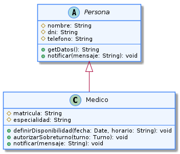

# Herencia

---

La **herencia** es un mecanismo que permite que una clase adquiera atributos y comportamientos de otra clase. Gracias a este principio es posible construir jerarquías donde las clases más específicas reutilizan características comunes y agregan funcionalidades propias. Esto favorece la reutilización del código y simplifica el mantenimiento del sistema. 

En UML, la herencia también se conoce como una relación de generalización/especialización, donde una clase general sirve como base para otras más específicas. 

---

## Ejemplo en el proyecto

La clase `Medico` hereda de `Persona`, reutilizando los datos comunes como nombre, apellido, documento y teléfono, además de incorporar responsabilidades específicas de su rol.



> Ver diagrama completo en: [herencia-ejemplo](../../diagramas/01-diagrama-clases/capturas-pilares/poo-herencia-ejemplo-1.png)

**Descripción del diagrama:**

`Persona` representa la información común a los distintos participantes del sistema, mientras que `Medico` extiende esa estructura incorporando funciones propias.

**Justificación técnica:**

La herencia evita repetir atributos comunes en varias clases y facilita la creación de nuevas especializaciones reutilizando una única definición base.

---

## Ejemplo de Código

```java
public class Persona {

    protected String nombre;
    protected String apellido;
}

public class Medico extends Persona {

    private String legajo;
}
```

**Justificación técnica del código:**

`Medico` reutiliza los atributos definidos en `Persona`, evitando duplicar información y manteniendo una jerarquía de clases coherente con el dominio del sistema.
