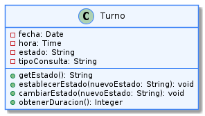

# Encapsulamiento

---

El encapsulamiento en este proyecto cumple una función más amplia que simplemente "ocultar datos": permite que la lógica de negocio se mantenga ordenada, que las reglas de turno no se rompan desde fuera y que cada clase controle su propio estado sin depender de decisiones arbitrarias de otras clases.

En el sistema de turnos médicos, esto es especialmente importante porque una cita puede pasar por varios cambios de estado y cada transición tiene consecuencias reales: afecta la disponibilidad horaria, el historial del turno, la notificación al paciente y la visibilidad en la agenda. Por eso, la información sensible no debe estar expuesta directamente.

El encapsulamiento también se relaciona con varios principios SOLID. En particular, refuerza el principio de Responsabilidad Única (SRP), porque cada clase mantiene bajo control su propio estado y sus reglas internas, evitando que otras clases deban manipular ese detalle. Asimismo, contribuye al principio de Abierto/Cerrado (OCP), ya que permite modificar la implementación interna de una clase sin afectar a las clases que usan su interfaz pública.

## Ejemplo en el proyecto

En la solución propuesta, el encapsulamiento aparece principalmente en dos puntos del dominio:

- la clase `Agenda`, que administra los turnos, los bloqueos y la disponibilidad;
- la clase `Turno`, que controla su propio ciclo de vida y sus cambios de estado.

Estas clases mantienen internamente datos como la lista de turnos asignados, los rangos bloqueados, el estado del turno y los registros de auditoría. Sin embargo, esas estructuras no se exponen de forma libre. Solo se accede a ellas mediante operaciones específicas diseñadas para preservar la integridad del sistema.



> Ver diagrama completo en: [encapsulamiento-ejemplo](../../diagramas/01-diagrama-clases/capturas-pilares/poo-encapsulamiento-ejemplo-1.png)

## Ejemplo de código

El siguiente fragmento muestra cómo la agenda encapsula la lógica de negocio y deja que las clases externas interactúen solo con su interfaz pública:

```java
public class Agenda {

    private final List<Turno> turnos = new ArrayList<>();
    private final GestorBloqueos gestorBloqueos = new GestorBloqueos();

    public Turno reservarTurno(Paciente paciente, Medico medico, LocalDateTime inicio) {
        validarDisponibilidad(inicio, medico);

        Turno turno = new Turno(paciente, medico, inicio);
        turnos.add(turno);
        return turno;
    }

    private void validarDisponibilidad(LocalDateTime inicio, Medico medico) {
        if (gestorBloqueos.estaBloqueado(inicio, medico)) {
            throw new IllegalStateException("El horario no está disponible");
        }
    }
}
```

Y, de forma similar, la clase `Turno` protege su propio estado:

```java
public class Turno {

    private String estado;
    private final LocalDateTime inicio;

    public Turno(Paciente paciente, Medico medico, LocalDateTime inicio) {
        this.estado = "Pendiente";
        this.inicio = inicio;
    }

    public void marcarPresente() {
        if (!"Pendiente".equals(this.estado)) {
            throw new IllegalStateException("El turno no puede pasar a presente");
        }
        this.estado = "Presente";
    }
}
```

**Justificación técnica del código:** En este ejemplo, los atributos internos de `Agenda` y `Turno` están protegidos mediante encapsulamiento y solo pueden ser modificados a través de métodos controlados. Se puede identificar el encapsulamiento observando los modificadores de acceso: en `Agenda`, los atributos `turnos` y `gestorBloqueos` están declarados como `private`, por lo que ninguna clase externa puede acceder ni modificar esas colecciones directamente; solo se puede interactuar con ellas a través del método público `reservarTurno()`. Lo mismo ocurre en `Turno`: el atributo `estado` es `private`, y no existe un método `setEstado()` público que permita cambiarlo libremente. La única forma de modificarlo es a través de `marcarPresente()`, que además valida la transición antes de aplicar el cambio. Es justamente la combinación de atributos `private`, ausencia de setters directos y métodos públicos controlados lo que permite identificar el encapsulamiento en el código.


