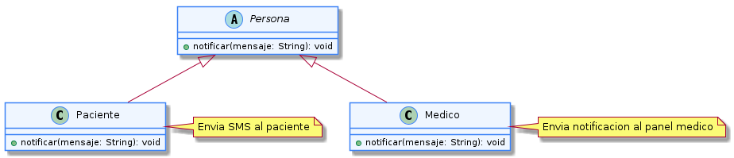

# Polimorfismo

---

El polimorfismo permite que distintos objetos respondan al mismo mensaje de forma diferente según su tipo concreto, sin que la clase que lo invoca necesite conocer los detalles de cada implementación. En el sistema de turnos médicos, esta idea es muy útil porque muchas operaciones del dominio pueden representarse con un mismo comportamiento general, aunque cada caso requiera una respuesta distinta.

En este proyecto, el polimorfismo aparece cuando una operación como "calcular duración", "mostrar la vista" o "aplicar una regla" se resuelve de manera distinta según el tipo de turno o la estrategia de visualización seleccionada. El resultado es un diseño más flexible, porque el código que usa esas clases no depende de una implementación concreta, sino de una interfaz o de una clase base común.

El polimorfismo se relaciona con varios principios SOLID. En particular, refuerza el principio de Abierto/Cerrado (OCP), porque permite agregar nuevos tipos de turno o nuevas estrategias sin modificar el código que ya consume la abstracción. Además, apoya el principio de Sustitución de Liskov (LSP), ya que las subclases pueden reemplazar a la clase base sin alterar el comportamiento esperado por el sistema.

## Ejemplo en el proyecto

Un ejemplo claro del polimorfismo en este sistema se observa en la forma en que los turnos pueden responder al mismo mensaje de negocio. Por ejemplo, todos los turnos pueden recibir una solicitud como "calcular duración", pero cada tipo de turno la resuelve según sus propias reglas: un turno de primera vez puede ocupar 30 minutos, mientras que un turno de control puede ocupar 15.

Esta idea también se relaciona con el patrón Strategy del proyecto, donde diferentes estrategias de visualización o de cálculo pueden intercambiarse sin modificar el código que las consume.



> Ver diagrama completo en: [polimorfismo-ejemplo](../../diagramas/01-diagrama-clases/capturas-pilares/poo-polimorfismo-ejemplo-1.png)

## ¿Por qué este ejemplo es válido?

La clase base `Turno` puede definir un método general como `calcularDuracion()`, pero cada subclase lo implementa a su manera. De este modo, el sistema puede tratar a todos los turnos con una referencia común y, sin embargo, obtener resultados distintos según el tipo concreto del objeto.

Esto mejora la extensibilidad del sistema, porque si en el futuro se agregan nuevos tipos de turnos o nuevas reglas de agenda, basta con agregar una nueva clase que implemente el comportamiento correspondiente. El código que usa la abstracción no tiene que modificarse.

## Ejemplo de código

El siguiente fragmento muestra cómo funciona el polimorfismo en Java:

```java
public abstract class Turno {

    protected LocalDateTime fechaHora;
    protected Paciente paciente;
    protected Medico medico;

    public Turno(Paciente paciente, Medico medico, LocalDateTime fechaHora) {
        this.paciente = paciente;
        this.medico = medico;
        this.fechaHora = fechaHora;
    }

    public abstract int calcularDuracion();
}

public class TurnoPrimeraVez extends Turno {

    @Override
    public int calcularDuracion() {
        return 30;
    }
}

public class TurnoControl extends Turno {

    @Override
    public int calcularDuracion() {
        return 15;
    }
}

public class Agenda {

    public void mostrarDuracionTurnos(List<Turno> turnos) {
        for (Turno turno : turnos) {
            System.out.println(turno.calcularDuracion());
        }
    }
}
```

**Justificación técnica del código:** En este ejemplo, `Agenda` no necesita saber si el turno es de primera vez, control o cualquier otro tipo. Solo invoca `calcularDuracion()` y el comportamiento correcto se resuelve según el objeto concreto que recibe.