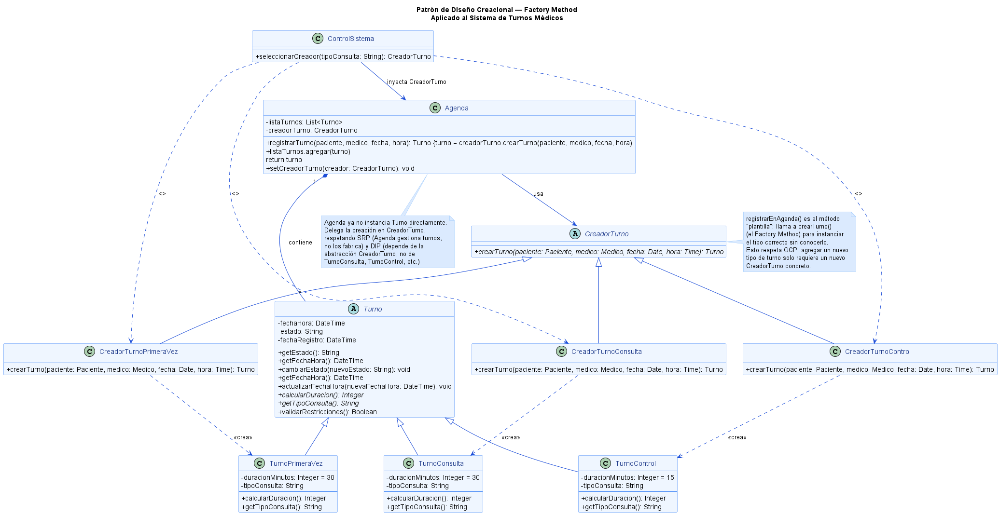

# Anexo – Aplicación de Patrón de Diseño Creacional – Factory Method

---

## Patrones de Diseño Creacionales y su relación con SOLID

Los patrones de diseño creacionales son soluciones reutilizables a problemas recurrentes de instanciación de objetos. Su propósito es desacoplar el código que usa los objetos del código que los crea, permitiendo que el sistema sea extensible sin modificar las clases existentes.

Su relación con los principios SOLID es directa:

- **SRP (Single Responsibility Principle):** al centralizar la lógica de creación en clases especializadas (los "creadores"), las clases de dominio como `Agenda` dejan de mezclar responsabilidades de gestión con responsabilidades de fabricación de objetos.
- **OCP (Open/Closed Principle):** los patrones creacionales permiten agregar nuevos tipos de objetos (nuevos tipos de turno, por ejemplo) creando nuevas subclases, sin modificar el código existente.
- **DIP (Dependency Inversion Principle):** el código cliente depende de abstracciones (el creador abstracto, el producto abstracto), no de implementaciones concretas.

El patrón **Factory Method** en particular formaliza esta idea: define una interfaz para crear objetos en una superclase, pero permite que las subclases decidan qué clase concreta instanciar.

---

## Propósito y Tipo del Patrón

**Tipo:** Factory Method (Patrón Creacional GoF)

**Propósito:**

En el Sistema de Turnos Médicos, la clase `Agenda` era responsable tanto de gestionar los turnos (consultarlos, bloquear franjas, registrar presencia) como de instanciarlos directamente mediante `registrarTurno()`. Cada vez que se creaba un turno, `Agenda` necesitaba conocer el tipo concreto (`TurnoConsulta`, `TurnoPrimeraVez`, `TurnoControl`) y sus particularidades (30 min para consulta y primera vez, 15 min para control). Esta lógica de instanciación acoplada en `Agenda` viola OCP: agregar un nuevo tipo de turno (por ejemplo, `TurnoEmergencia`) requería modificar directamente el método `registrarTurno()` de `Agenda`.

El Factory Method soluciona esto extrayendo la responsabilidad de creación a una jerarquía de clases `CreadorTurno`, dejando a `Agenda` dependiendo únicamente de la abstracción `CreadorTurno` y del producto abstracto `Turno`.

---

## Motivación

### Problema original

En el diseño actual del STM, `Agenda.registrarTurno(datos: Map)` recibe un mapa con todos los parámetros del turno, incluyendo el tipo de consulta, y produce un `Turno` instanciando la clase concreta correspondiente. Esto significa que `Agenda` conoce los tres tipos concretos de turno y su lógica de duración:

- Si `tipoConsulta == "Consulta"` → instanciar con duración 30 min
- Si `tipoConsulta == "PrimeraVez"` → instanciar con duración 30 min
- Si `tipoConsulta == "Control"` → instanciar con duración 15 min

Este diseño presenta tres problemas concretos:

1. **Violación de OCP:** agregar `TurnoEmergencia` (60 min) requiere modificar `Agenda`, una clase que ya funciona correctamente y tiene muchas otras responsabilidades.
2. **Violación de SRP:** `Agenda` mezcla gestión de disponibilidad, bloqueo de franjas, registro de presencia y cancelación de recordatorios con la fábrica de objetos `Turno`.
3. **Violación de DIP:** `Agenda` depende de las clases concretas de turno, no de una abstracción.

### Solución con Factory Method

El patrón introduce una jerarquía de **Creadores** paralela a la jerarquía de **Productos**:

**Productos (la jerarquía de Turno):**
- `Turno` (abstracto): define la interfaz común con `calcularDuracion()` abstracto.
- `TurnoConsulta`: implementa `calcularDuracion()` → 30 minutos.
- `TurnoPrimeraVez`: implementa `calcularDuracion()` → 30 minutos.
- `TurnoControl`: implementa `calcularDuracion()` → 15 minutos.

**Creadores (la jerarquía de Factory):**
- `CreadorTurno` (abstracto): define el Factory Method `crearTurno()` y el método plantilla `registrarEnAgenda()`, que llama internamente a `crearTurno()`.
- `CreadorTurnoConsulta`: implementa `crearTurno()` → instancia `TurnoConsulta`.
- `CreadorTurnoPrimeraVez`: implementa `crearTurno()` → instancia `TurnoPrimeraVez`.
- `CreadorTurnoControl`: implementa `crearTurno()` → instancia `TurnoControl`.

**Agenda** recibe un `CreadorTurno` por inyección y delega la creación: `agenda.setCreadorTurno(new CreadorTurnoPrimeraVez())`. Cuando necesita crear un turno, invoca `creadorTurno.registrarEnAgenda(...)`, que internamente llama al Factory Method correcto sin que `Agenda` lo sepa.

Para agregar `TurnoEmergencia` en el futuro, solo se crean dos clases nuevas: `TurnoEmergencia` y `CreadorTurnoEmergencia`. `Agenda` no se toca.

---

## Estructura de Clases

Solo se incluyen las clases directamente involucradas en la implementación del patrón.

[Ver diagrama en tamaño completo](../../diagramas/01-diagrama-clases/01-patron-creacional-factory-method.puml)

---

## Justificación Técnica de la Estructura de Clases

### Descripción de cada clase

**`Turno` (Producto Abstracto)**
- Responsabilidad: define la interfaz común de todos los tipos de turno del sistema.
- Declara `calcularDuracion()` y `getTipoConsulta()` como métodos abstractos, obligando a cada subclase a implementar su propia lógica de duración.
- Es necesaria porque permite que `Agenda` y `ControlSistema` trabajen con cualquier tipo de turno sin conocer su implementación concreta. Es la base del polimorfismo en la jerarquía de productos.

**`TurnoConsulta`, `TurnoPrimeraVez`, `TurnoControl` (Productos Concretos)**
- Responsabilidad: encapsular la lógica específica de cada tipo de turno.
- `TurnoConsulta` y `TurnoPrimeraVez` retornan 30 minutos en `calcularDuracion()`. `TurnoControl` retorna 15 minutos.
- Son necesarias para representar fielmente el dominio del STM (RF2: tipos de turno con duración diferente) y para que el sistema pueda bloquear la franja horaria correcta según el tipo.

**`CreadorTurno` (Creador Abstracto)**
- Responsabilidad: definir el contrato del Factory Method (`crearTurno()`) y el método plantilla `registrarEnAgenda()` que orquesta la creación y registro.
- `registrarEnAgenda()` llama a `crearTurno()` internamente: el código de registro es siempre el mismo, solo varía el tipo de objeto creado.
- Es necesaria para que `Agenda` dependa de una abstracción (DIP) y no de las clases concretas de turno.

**`CreadorTurnoConsulta`, `CreadorTurnoPrimeraVez`, `CreadorTurnoControl` (Creadores Concretos)**
- Responsabilidad: implementar el Factory Method instanciando el producto concreto correspondiente.
- Cada uno conoce únicamente su tipo de turno. El aislamiento garantiza que la lógica de creación de `TurnoControl` no afecta ni conoce la de `TurnoConsulta`.
- Son necesarios para que el sistema sea extensible (OCP): agregar un nuevo tipo de turno implica solo agregar un nuevo par `TurnoNuevo` + `CreadorTurnoNuevo`.

**`Agenda` (Cliente del Factory)**
- Responsabilidad: gestionar la disponibilidad, el bloqueo de franjas y el ciclo de vida de los turnos.
- Con el patrón aplicado, `Agenda` recibe el creador apropiado por inyección (`setCreadorTurno()`) y delega la instanciación. Ya no contiene lógica de `if/switch` por tipo de turno.
- Es necesaria como punto de coordinación central del dominio (RNF5).

### Flujo de creación de objetos

1. La `Secretaria` selecciona el tipo de consulta (ej: "Primera vez") e inicia el registro.
2. `ControlSistema` determina qué creador usar y lo inyecta en `Agenda`: `agenda.setCreadorTurno(new CreadorTurnoPrimeraVez())`.
3. `Agenda` invoca `creadorTurno.registrarEnAgenda(agenda, paciente, medico, fecha, hora)`.
4. `CreadorTurnoPrimeraVez.registrarEnAgenda()` llama al Factory Method: `crearTurno()` → instancia `TurnoPrimeraVez`.
5. El `TurnoPrimeraVez` queda registrado en la `Agenda` con estado "Pendiente" y duración 30 minutos.
6. `Agenda` bloquea la franja horaria usando `turno.calcularDuracion()` — sin conocer el tipo concreto.
