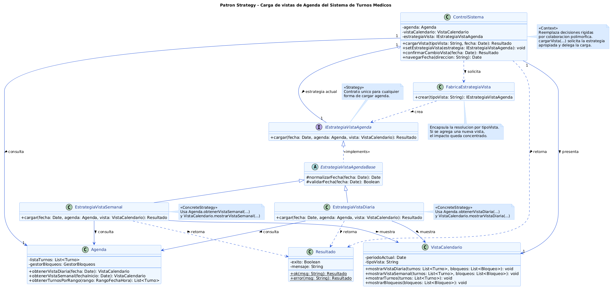

# Anexo - Aplicación de Patrón de Diseño de Comportamiento - Strategy

---

## Patrones de Diseño de Comportamiento y su relación con SOLID

Los patrones de comportamiento de GoF se enfocan en la forma en que los objetos colaboran entre sí para resolver un proceso del negocio. Su objetivo principal consiste en distribuir responsabilidades entre clases especializadas, evitando que una única clase concentre toda la lógica de ejecución del sistema.

Dentro del Sistema de Turnos Médicos, este tipo de patrones resulta especialmente útil para encapsular comportamientos que pueden variar con el tiempo sin afectar la estructura general del modelo. De esta manera, la evolución funcional del sistema puede realizarse incorporando nuevas implementaciones sin modificar las clases responsables de coordinar los casos de uso.

La aplicación del patrón **Strategy** mantiene una relación directa con varios principios SOLID desarrollados durante el proyecto.

- **SRP:** cada estrategia implementa exclusivamente un algoritmo de carga de agenda.
- **OCP:** es posible incorporar nuevas modalidades de visualización sin modificar el contexto principal.
- **LSP:** todas las estrategias concretas pueden sustituirse utilizando la misma interfaz.
- **DIP:** `ControlSistema` depende de la abstracción `IEstrategiaVistaAgenda` y no de implementaciones concretas.

Como consecuencia, el sistema obtiene un menor acoplamiento, una mejor distribución de responsabilidades y una arquitectura preparada para futuras ampliaciones.

---

## Propósito y Tipo del Patrón

### Problema encontrado en el sistema actual

Durante el análisis del diagrama de clases final se observó que el comportamiento encargado de cargar la agenda médica varía según el tipo de vista solicitado por el usuario.

Actualmente el sistema contempla la visualización diaria y semanal, utilizando un parámetro (`tipoVista`) para determinar qué comportamiento ejecutar.

Este enfoque provoca que `ControlSistema` concentre la decisión del algoritmo correspondiente, generando un punto de crecimiento que obliga a modificar la misma clase cada vez que aparece una nueva modalidad de visualización.

A medida que el sistema evolucione podrían incorporarse nuevas alternativas, como una vista mensual, por especialidad o por profesional, incrementando la cantidad de decisiones dentro del controlador y afectando su mantenibilidad.

### Objetivo del patrón

Encapsular cada algoritmo de carga de agenda dentro de una estrategia independiente, permitiendo que `ControlSistema` únicamente coordine el flujo del caso de uso y delegue la ejecución sobre la estrategia correspondiente.

Cada modalidad de visualización queda representada mediante un objeto especializado e intercambiable, eliminando la necesidad de incorporar nuevas estructuras condicionales dentro del controlador.

### Tipo del patrón elegido

Se seleccionó el patrón de comportamiento **Strategy**.

La elección se fundamenta en que el problema identificado corresponde a la existencia de distintos algoritmos para resolver una misma operación del sistema.

Cada estrategia implementa una forma diferente de cargar la agenda médica, manteniendo un contrato común definido por `IEstrategiaVistaAgenda`, lo que permite intercambiar comportamientos de forma transparente sin modificar el contexto que los utiliza.

---
## Motivación

### Funcionamiento original del sistema

El diagrama de clases final del proyecto establece que `ControlSistema` coordina la carga de la agenda médica y la presentación de la información mediante `VistaCalendario`. Para realizar esta tarea, recibe el parámetro `tipoVista`, que determina la modalidad de visualización solicitada por el usuario.

Actualmente el sistema contempla dos modalidades principales: vista diaria y vista semanal. Dependiendo del valor recibido, `ControlSistema` debe seleccionar el algoritmo adecuado para obtener la información correspondiente desde `Agenda`.

Si bien esta solución resulta funcional para las vistas existentes, concentra la lógica de decisión dentro del controlador, generando un punto de crecimiento que afecta la mantenibilidad del sistema.

### Limitaciones detectadas

Durante el análisis del diseño se identificaron las siguientes limitaciones:

- Alto acoplamiento entre `ControlSistema` y los distintos algoritmos de carga de agenda.
- Baja extensibilidad, ya que cada nueva modalidad de visualización requiere modificar el controlador.
- Incremento de estructuras condicionales (`if` o `switch`) para seleccionar el algoritmo correspondiente.
- Mezcla de responsabilidades entre la coordinación del caso de uso y la implementación del comportamiento.
- Mayor riesgo de introducir errores al modificar una clase que concentra toda la lógica de decisión.

### Clases involucradas en el problema

Las principales clases relacionadas con este comportamiento son:

- `ControlSistema`, responsable de coordinar el caso de uso.
- `Agenda`, encargada de administrar la información de los turnos médicos.
- `VistaCalendario`, responsable de representar la información obtenida.
- `Resultado`, utilizado para comunicar el estado de la operación.

### Por qué la solución anterior era poco flexible

La decisión del algoritmo dependía directamente del valor de `tipoVista`, procesado por `ControlSistema`.

Ante la necesidad de incorporar nuevas modalidades de visualización, como una vista mensual, una vista por especialidad o una vista personalizada para cada profesional, sería necesario modificar nuevamente el controlador principal.

Este enfoque incumple el principio **Open/Closed**, ya que las nuevas funcionalidades obligan a modificar código existente en lugar de extender el comportamiento mediante nuevas implementaciones.

### Reorganización del comportamiento con Strategy

Para resolver estas limitaciones se incorpora la interfaz `IEstrategiaVistaAgenda`, que define el contrato común para todas las modalidades de carga de agenda.

A partir de esta abstracción se implementan dos estrategias concretas:

- `EstrategiaVistaDiaria`, encargada de encapsular el algoritmo correspondiente a la vista diaria.
- `EstrategiaVistaSemanal`, responsable del algoritmo correspondiente a la vista semanal.

Además, se incorpora la clase abstracta `EstrategiaVistaAgendaBase`, que concentra comportamiento compartido entre ambas estrategias, evitando duplicación de código.

La selección de la estrategia adecuada queda centralizada en `FabricaEstrategiaVista`, mientras que `ControlSistema` conserva únicamente la responsabilidad de coordinar el caso de uso y delegar la ejecución sobre la estrategia correspondiente.

### Ventajas obtenidas en el Sistema de Turnos Médicos

La aplicación del patrón Strategy aporta diversas mejoras al diseño del sistema:

- Reduce el acoplamiento entre el controlador y la lógica de carga de agenda.
- Facilita la incorporación de nuevas modalidades de visualización sin modificar `ControlSistema`.
- Favorece la reutilización del comportamiento compartido entre distintas estrategias.
- Mejora la mantenibilidad al distribuir responsabilidades en clases especializadas.
- Refuerza la aplicación de los principios SOLID desarrollados durante el proyecto.
- Mantiene una arquitectura preparada para futuras ampliaciones del Sistema de Turnos Médicos.

---

## Estructura de Clases

El diagrama UML desarrollado representa únicamente las clases involucradas en la implementación del patrón **Strategy**, manteniendo coherencia con el diagrama de clases final del Sistema de Turnos Médicos.

La propuesta conserva las clases existentes del dominio (`ControlSistema`, `Agenda`, `VistaCalendario` y `Resultado`) e incorpora únicamente los elementos necesarios para aplicar el patrón, evitando modificar la arquitectura previamente definida durante el proyecto.

El objetivo de esta reorganización es separar la responsabilidad de seleccionar el algoritmo de carga de agenda del controlador principal, permitiendo que cada modalidad de visualización se encuentre encapsulada en una estrategia independiente.

[Abrir imagen del diagrama](../../diagramas/01-diagrama-clases/01-patron-comportamiento-strategy.png)

---

## Justificación Técnica de la Estructura de Clases

### Responsabilidad de cada clase

- **ControlSistema:** actúa como el contexto del patrón Strategy. Coordina el flujo del caso de uso y delega la carga de la agenda en la estrategia seleccionada sin conocer su implementación concreta.

- **IEstrategiaVistaAgenda:** define el contrato común para todas las estrategias encargadas de cargar la agenda. Gracias a esta abstracción, el contexto puede trabajar de forma uniforme con cualquier implementación.

- **EstrategiaVistaAgendaBase:** concentra comportamiento compartido entre las distintas estrategias, evitando duplicación de código y favoreciendo la reutilización de funcionalidades comunes.

- **EstrategiaVistaDiaria:** implementa el algoritmo encargado de obtener y mostrar la agenda correspondiente a una vista diaria.

- **EstrategiaVistaSemanal:** implementa el algoritmo responsable de obtener y mostrar la agenda correspondiente a una vista semanal.

- **FabricaEstrategiaVista:** centraliza la creación de la estrategia adecuada según el tipo de vista solicitado, evitando que esta responsabilidad se distribuya en otras clases del sistema.

- **Agenda:** mantiene su responsabilidad original como administradora de la información de turnos y proveedora de los datos utilizados por las distintas estrategias.

- **VistaCalendario:** continúa siendo la responsable de representar la información obtenida. En el contexto del patrón Strategy actúa como el destino uniforme donde todas las estrategias actualizan los datos. Expone métodos especializados (`mostrarVistaDiaria()`, `mostrarVistaSemanal()`) que cada estrategia invoca según su naturaleza, manteniendo separadas la lógica de carga (estrategia) y la presentación visual.

- **Resultado:** mantiene un formato uniforme para comunicar el éxito o error de la operación realizada, independizando la lógica del patrón de la interfaz de usuario.

### Cómo colaboran entre sí

El funcionamiento del patrón comienza cuando el usuario solicita visualizar la agenda indicando el tipo de vista deseado.

`ControlSistema` recibe la solicitud y consulta a `FabricaEstrategiaVista` para obtener la estrategia correspondiente. Una vez obtenida, delega la ejecución del algoritmo sin conocer su implementación específica.

La estrategia seleccionada utiliza los servicios de `Agenda` para recuperar la información necesaria y posteriormente actualiza `VistaCalendario` con los datos obtenidos.

Finalmente, la estrategia devuelve un objeto `Resultado` que indica el estado de la operación, manteniendo una comunicación uniforme entre las distintas capas del sistema.

### Flujo completo del patrón

1. El usuario solicita visualizar la agenda.
2. `ControlSistema` recibe la solicitud.
3. `ControlSistema` solicita a `FabricaEstrategiaVista` la estrategia correspondiente.
4. La fábrica devuelve una implementación de `IEstrategiaVistaAgenda`.
5. La estrategia consulta la información necesaria mediante `Agenda`.
6. `Agenda` devuelve la estructura de datos correspondiente al período solicitado (diario o semanal).
7. La estrategia actualiza `VistaCalendario`.
8. Se devuelve un objeto `Resultado` indicando el resultado de la operación.

### Cómo mejora la mantenibilidad

La incorporación del patrón Strategy reduce el tamaño y la complejidad de `ControlSistema`, ya que elimina la necesidad de incorporar nuevas estructuras condicionales para cada modalidad de visualización.

Cada algoritmo queda encapsulado en una clase especializada, facilitando el mantenimiento, la lectura del código y la localización de futuras modificaciones.

### Cómo mejora la extensibilidad

Si el Sistema de Turnos Médicos necesitara incorporar nuevas modalidades de visualización, únicamente sería necesario crear una nueva estrategia que implemente `IEstrategiaVistaAgenda`.

De esta manera, el controlador principal permanecería sin modificaciones, respetando el principio Open/Closed y facilitando la evolución del sistema.

El impacto de creación queda acotado en `FabricaEstrategiaVista`, donde se incorpora el mapeo de la nueva estrategia sin alterar la lógica de coordinación del contexto.

### Principios SOLID reforzados

- **SRP:** cada estrategia implementa un único algoritmo de carga de agenda.
- **OCP:** nuevas modalidades de visualización pueden incorporarse sin modificar el contexto.
- **LSP:** todas las estrategias pueden sustituirse utilizando la misma interfaz.
- **DIP:** `ControlSistema` depende de una abstracción y no de implementaciones concretas.

### Beneficios para futuras ampliaciones

La solución propuesta permite incorporar nuevas vistas de agenda, como una vista mensual, una vista por especialidad o una vista personalizada para distintos roles del sistema, manteniendo un impacto mínimo sobre el resto de la arquitectura.

Además, favorece la reutilización de componentes existentes, mejora la organización del modelo UML y mantiene una arquitectura preparada para futuras ampliaciones del Sistema de Turnos Médicos.