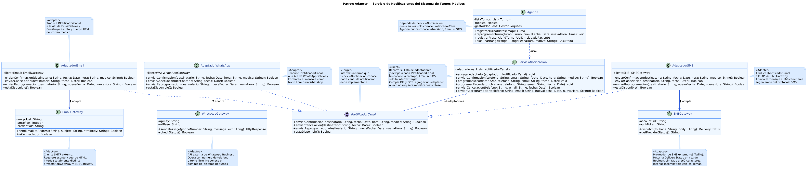

# Patrón de Diseño Estructural — Adapter

---

## 1. Propósito y Tipo del Patrón

### Patrones estructurales y su relación con SOLID

Los patrones de diseño estructurales de GoF se ocupan de cómo se componen clases y objetos para formar estructuras más grandes, sin perder flexibilidad ni claridad. Su objetivo no es describir algoritmos ni flujos de control, sino establecer la forma en que las piezas del sistema se conectan entre sí.

Su relación con los principios SOLID es directa:

| Principio | Cómo lo refuerzan los patrones estructurales |
|-----------|---------------------------------------------|
| SRP | Separan la lógica de adaptación o composición en clases dedicadas, evitando que una clase acumule responsabilidades de traducción además de las propias |
| OCP | Permiten extender el comportamiento del sistema (nuevos canales, componentes, decoradores) sin modificar las clases existentes |
| DIP | El cliente depende de una abstracción (interfaz target), no de implementaciones concretas |
| ISP | Las interfaces target son reducidas y específicas; cada adaptador implementa solo lo que corresponde |

### El patrón Adapter

El patrón **Adapter** (también llamado *Wrapper*) permite que dos clases con interfaces incompatibles trabajen juntas. Introduce una clase intermediaria —el *Adapter*— que traduce las llamadas de la interfaz que el cliente conoce (*target*) a las llamadas que requiere la clase existente (*adaptee*).

### Problema específico y cómo el patrón lo soluciona

**Problema:** `ServicioNotificacion` era una clase concreta que enviaba notificaciones únicamente a través de WhatsApp. `Agenda` la creaba directamente (`<<crea>>`), acoplándose a una implementación específica. Para agregar notificaciones por email o SMS, era necesario modificar tanto `ServicioNotificacion` como `Agenda`, violando OCP y DIP. Adicionalmente, cada proveedor externo (WhatsApp Business API, SMTP, Twilio) expone una interfaz completamente distinta: métodos con nombres, parámetros y tipos de retorno incompatibles entre sí.

**Solución:** Se introduce la interfaz `INotificadorCanal` como *target*. Cada proveedor externo es envuelto por un *Adapter* (`AdaptadorWhatsApp`, `AdaptadorEmail`, `AdaptadorSMS`) que traduce `INotificadorCanal` a la API del proveedor correspondiente. `ServicioNotificacion` pasa a ser el *client*: solo conoce `INotificadorCanal` y delega en los canales registrados. `Agenda` ya no crea ni conoce ningún canal concreto; solo usa `ServicioNotificacion`.

---

## 2. Motivación

### Problema en profundidad

El sistema de turnos médicos contempla notificaciones como parte del flujo de negocio: confirmación de turno (CU1), recordatorios automáticos, notificación de reprogramación (CU3) y cancelación de recordatorios tras check-in (CU2). En el diagrama final (v4), `Agenda` era responsable de crear `ServicioNotificacion` y `ServicioNotificacion` concentraba toda la lógica de envío para un único canal, WhatsApp.

Este diseño presentaba tres problemas concretos:

1. **Dificultad para incorporar nuevos canales de notificación**

El sistema estaba diseñado para enviar notificaciones únicamente mediante WhatsApp. Si la clínica necesitaba incorporar un nuevo canal, como email o SMS, era necesario modificar ServicioNotificacion para agregar la lógica correspondiente. Esto dificultaba extender el sistema con nuevas alternativas de comunicación y hacía que cada incorporación implicara cambios sobre código existente.

2. **Interfaces externas incompatibles**

Cada proveedor de notificaciones ofrece una API diferente. Mientras WhatsApp utiliza un método como sendMessage(phoneNumber, messageText), un servicio de correo electrónico requiere dirección, asunto y cuerpo del mensaje, y un proveedor de SMS puede devolver un tipo de dato distinto. Estas diferencias impiden utilizar todos los proveedores mediante una interfaz común, obligando al sistema a adaptarse a cada API en particular.

3. **Dependencia directa de infraestructura**

La lógica del sistema quedaba vinculada a clases concretas encargadas de comunicarse con proveedores externos de notificaciones. Como consecuencia, las clases del dominio terminaban dependiendo de implementaciones específicas de infraestructura en lugar de hacerlo de una abstracción. Esto incrementaba el acoplamiento entre ambas capas y reducía la flexibilidad de la arquitectura ante cambios tecnológicos.

### Cómo el patrón Adapter resuelve el problema

El patrón introduce un nivel de indirección mediante la interfaz *target* `INotificadorCanal`. El vocabulario del patrón en este sistema es el siguiente:

| Rol GoF | Clase en el sistema | Descripción |
|---------|--------------------|-------------------------------------------------|
| **Target** | `INotificadorCanal` | Interfaz uniforme que el client conoce. Define `enviarConfirmacion()`, `enviarCancelacion()`, `enviarReprogramacion()` y `estaDisponible()` |
| **Client** | `ServicioNotificacion` | Usa `INotificadorCanal`. Mantiene una lista de adapters para traducir la misma operación de negocio a APIs externas incompatibles, sin conocer proveedores concretos |
| **Adapter** | `AdaptadorWhatsApp` | Implementa `INotificadorCanal` y traduce las llamadas a `WhatsAppGateway.sendMessage()` |
| **Adapter** | `AdaptadorEmail` | Implementa `INotificadorCanal` y construye asunto + cuerpo HTML antes de llamar a `EmailGateway.sendEmail()` |
| **Adapter** | `AdaptadorSMS` | Implementa `INotificadorCanal`, trunca el mensaje a 160 caracteres y convierte el `DeliveryStatus` de retorno a `Boolean` antes de delegar en `SMSGateway.dispatch()` |
| **Adaptee** | `WhatsAppGateway` | API externa de WhatsApp Business. Interfaz propia, no modificable |
| **Adaptee** | `EmailGateway` | Cliente SMTP externo. Interfaz propia, no modificable |
| **Adaptee** | `SMSGateway` | Proveedor de SMS externo (ej. Twilio). Interfaz propia, no modificable |

### Clases implicadas: rol y responsabilidad

**`INotificadorCanal` (nueva — target):**  
Define el contrato mínimo para cualquier canal de notificación del sistema. Es la única cosa que `ServicioNotificacion` conoce de los canales. Su existencia permite cumplir DIP: el dominio depende de esta abstracción, nunca de los proveedores concretos.

**`ServicioNotificacion` (modificada — client):**  
Deja de ser un canal concreto y pasa a ser un *orquestador de adapters*. Mantiene una lista de `INotificadorCanal` porque cada elemento traduce el mismo contrato del dominio hacia una API externa incompatible. Al recibir una solicitud de notificación, delega en los adapters disponibles sin conocer detalles del proveedor. Esta separación hace explícito que la responsabilidad central es la adaptación de interfaces y no la lógica del canal externo.

**`AdaptadorWhatsApp`, `AdaptadorEmail`, `AdaptadorSMS` (nuevas — adapters):**  
Cada uno conoce exactamente un adaptee. Su única responsabilidad es traducir el vocabulario de `INotificadorCanal` al vocabulario de la API concreta. Por ejemplo, `AdaptadorSMS` sabe que `SMSGateway.dispatch()` devuelve `DeliveryStatus`, y lo convierte a `Boolean` para respetar el contrato del target. Cada adapter también implementa `estaDisponible()` consultando el estado del proveedor, lo que permite que `ServicioNotificacion` omita un canal si su proveedor está caído.

**`WhatsAppGateway`, `EmailGateway`, `SMSGateway` (existentes o de terceros — adaptees):**  
Son clases externas cuya interfaz no se controla ni se modifica. El patrón Adapter es precisamente la herramienta para trabajar con APIs de terceros sin acoplar el dominio a ellas.

**`Agenda` (sin cambios en su interfaz):**  
Sigue usando `ServicioNotificacion` para notificaciones. Con el patrón aplicado, `Agenda` no necesita cambiar cuando se incorpora un nuevo canal: basta con crear un nuevo adapter e inyectarlo en `ServicioNotificacion`.

### Diagrama de clases

## Patrón Estructural - Adapter

---

## 3. Relación con los principios SOLID del proyecto

| Principio | Impacto del patrón Adapter |
|-----------|---------------------------|
| **SRP** | Cada adapter tiene una única responsabilidad: traducir un proveedor. `ServicioNotificacion` tiene una sola responsabilidad: orquestar canales. Ya no mezcla lógica de WhatsApp con la de otros canales |
| **OCP** | Para agregar un canal nuevo (ej. notificación push) basta con crear `AdaptadorPush` que implemente `INotificadorCanal` e inyectarlo. Ni `ServicioNotificacion` ni `Agenda` se modifican |
| **LSP** | Cualquier `INotificadorCanal` puede reemplazar a otro en `ServicioNotificacion` sin alterar el comportamiento esperado. El contrato del target se respeta en todos los adapters |
| **DIP** | `Agenda` depende de `ServicioNotificacion`; esta depende de `INotificadorCanal`, una abstracción. Ninguna clase del dominio depende de `WhatsAppGateway`, `EmailGateway` ni `SMSGateway` |
