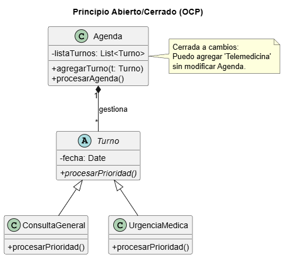

# Principio Abierto/Cerrado (OCP)

## Propósito y Tipo del Principio SOLID
El **OCP (Open/Closed Principle)** indica que las entidades de software deben estar **abiertas para su extensión** pero **cerradas para su modificación** [11, 12]. Esto permite que el comportamiento de un sistema se altere añadiendo código nuevo en lugar de tocar el código ya existente y probado [13].

## Motivación
Originalmente, la clase **Agenda** utilizaba estructuras de control condicionales (`if/else`) para procesar distintos tipos de citas (consultas, cirugías, urgencias). Cada vez que se requería un nuevo tipo de turno, como "Telemedicina", era obligatorio abrir el código de la Agenda para modificar la lógica, aumentando el riesgo de introducir errores [14, 15].

## Explicación de Herencia
La **herencia** es una relación entre clases donde una subclase hereda atributos y métodos de una superclase [16]. En el contexto de OCP, se utiliza para crear una jerarquía donde la clase base define el comportamiento general y las subclases extienden la funcionalidad específica sin alterar la base [17, 18].

## Estructura de Clases

*[Ver diagrama en detalle](../../diagramas/01-diagrama-clases/02-ocp.puml)*

## Justificación Técnica
Se aplicó el **polimorfismo** mediante una clase abstracta `Turno`. Ahora, la clase `Agenda` procesa objetos de tipo `Turno` de forma genérica. Si el consultorio decide incorporar nuevos tipos de atención, solo se requiere crear una nueva subclase que herede de `Turno`, manteniendo la lógica de la Agenda intacta y cerrada a modificaciones [13, 14].