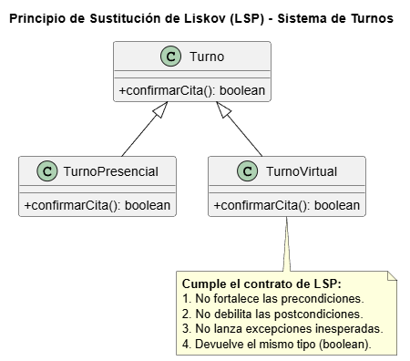

# Principio de Sustitución de Liskov (LSP)

## Propósito y Tipo del Principio SOLID
El **LSP (Liskov Substitution Principle)** establece que los objetos de un programa deben poder ser reemplazados por instancias de sus subtipos sin alterar la correctitud del programa [11, 19]. Una subclase debe poder usarse como si fuera su padre sin necesidad de que el cliente conozca las diferencias entre ellas [20].

## Motivación
Se detectó un problema potencial en el procesamiento de turnos cancelados. Si una subclase lanzaba excepciones inesperadas o devolvía valores nulos en métodos que la superclase `Turno` garantizaba como estables, la clase `Agenda` fallaría al intentar sustituir un tipo de turno por otro, rompiendo la estabilidad del sistema [20, 21].

## Explicación de Herencia
Para cumplir con LSP, la herencia se gestiona bajo un **diseño por contrato**: las subclases no pueden fortalecer las precondiciones (pedir más que el padre) ni debilitar las postcondiciones (entregar menos que el padre) de los métodos heredados [20, 22].

## Estructura de Clases

*[Ver diagrama en detalle](../../diagramas/01-diagrama-clases/03-lsp.puml)*

## Justificación Técnica
El diseño asegura que cualquier especialización de `Turno` respete el contrato de los métodos `confirmar()` y `cancelar()`. Al garantizar que la `Agenda` pueda tratar a todos los turnos de manera uniforme bajo la interfaz de la superclase, logramos una arquitectura con **partes intercambiables** y comportamiento predecible [19, 23].