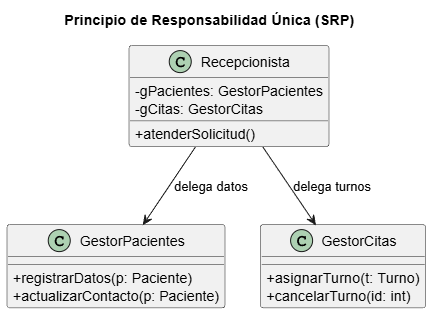

# Principio de Responsabilidad Única (SRP)

## Propósito y Tipo del Principio SOLID
El **SRP (Single Responsibility Principle)** establece que un módulo o clase debe tener una, y solo una, razón para cambiar [5, 6]. Su objetivo primordial es aumentar la **cohesión**, agrupando responsabilidades que cambian por el mismo motivo y separando aquellas que responden a actores diferentes [7].

## Motivación
En el diseño inicial, se detectó que la clase **Recepcionista** (Tarjeta CRC 05) asumía responsabilidades mixtas: gestionaba datos personales de los pacientes, administraba la creación de turnos y manejaba la lógica de confirmación mediante notificaciones. Si el consultorio cambiaba su política de protección de datos o su proveedor de mensajería, la misma clase debía ser modificada, violando el principio [8, 9].

## Estructura de Clases

## Estructura de Clases

*[Ver diagrama en detalle](../../diagramas/01-diagrama-clases/01-srp.puml)*

## Justificación Técnica
La refactorización divide a la clase original en entidades especializadas como `GestorPacientes` y `GestorCitas`. Esto asegura que cada clase responda a un único actor del negocio (ej. el administrativo encargado de la base de datos vs. el encargado de la agenda clínica), reduciendo la **fragilidad** del sistema ante cambios normativos o técnicos [7, 10].