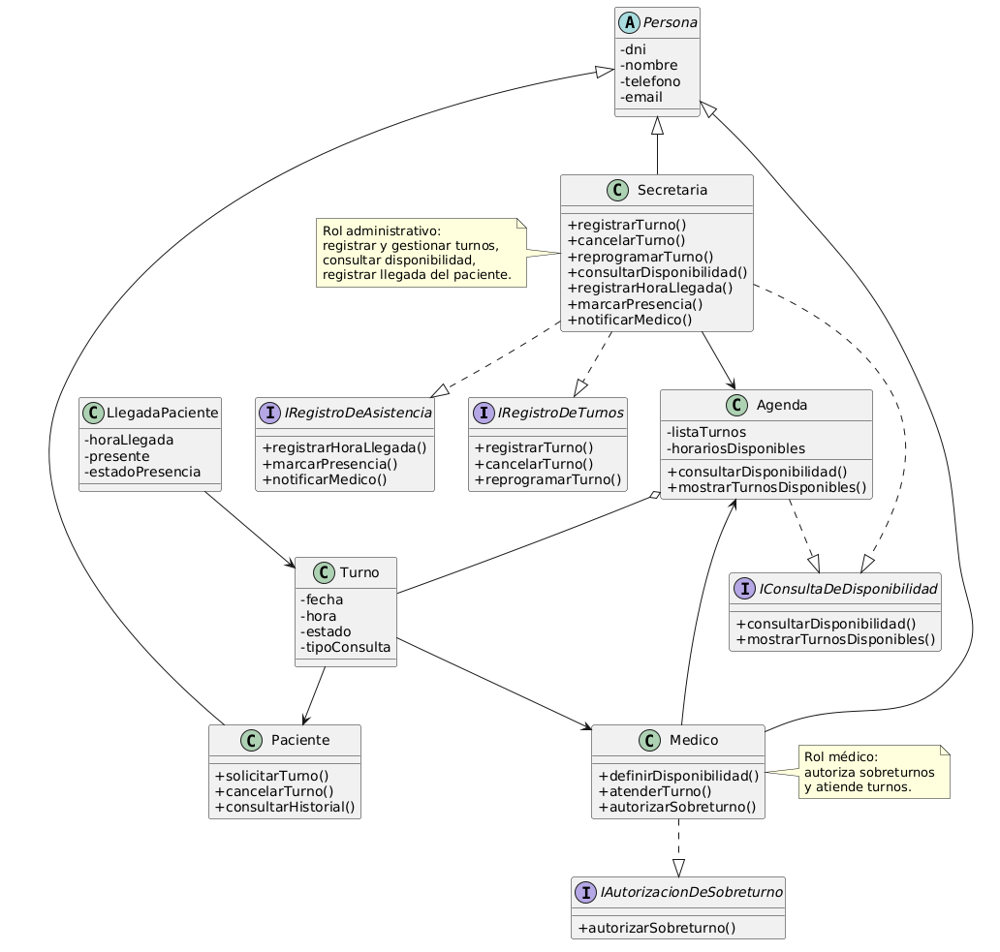

# Principio de Segregación de Interfaces (ISP)

## Propósito y Tipo del Principio SOLID
El **ISP (Interface Segregation Principle)** defiende que es mejor tener muchas interfaces específicas para cada cliente que una sola interfaz de propósito general [20, 24]. El objetivo es evitar que las clases dependan de métodos que no utilizan, reduciendo el acoplamiento innecesario [19, 25].

## Motivación
En el diseño inicial, existía una interfaz genérica `IGestorConsultorio` que contenía tanto la lógica médica (historia clínica) como la administrativa (cobros). Esto obligaba a la **Recepcionista** a implementar métodos de atención médica irrelevantes para su rol, creando una "interfaz gorda" y contaminada [26, 27].

## Explicación de Interfaces
Una **interfaz** es un contrato de servicios que especifica un aspecto de la funcionalidad de una clase mediante firmas de métodos, pero sin proveer su implementación ni campos de datos [28, 29].

## Estructura de Clases

*[Ver diagrama en detalle](../../diagramas/01-diagrama-clases/01-solid-04-isp.puml)*

## Justificación Técnica
Se segregó la interfaz original en `IAtencionMedica` e `IGestionTurnos`. Esto permite que la clase `Medico` y la clase `Recepcionista` dependan únicamente de los métodos que les competen. La solución elimina dependencias hacia operaciones no utilizadas, facilitando el mantenimiento y permitiendo que cambios en los procesos de cobro no afecten la interfaz que utiliza el médico [30, 31].