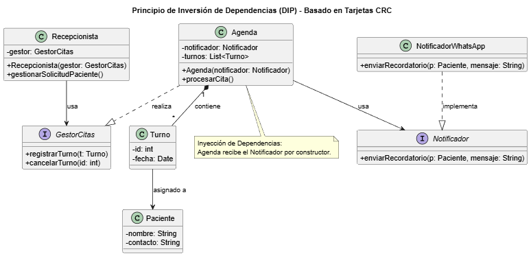

# Principio de Inversión de Dependencias (DIP)

## Propósito y Tipo del Principio SOLID
El **DIP (Dependency Inversion Principle)** establece que los módulos de alto nivel no deben depender de los módulos de bajo nivel; ambos deben depender de **abstracciones** [8, 24]. El objetivo es asegurar que las reglas de negocio no se vean afectadas por cambios en los detalles técnicos [32].

## Motivación
Se identificó que la clase de alto nivel **Recepcionista** dependía directamente de la implementación concreta de la **Agenda**. Asimismo, la Agenda estaba acoplada a la clase `NotificadorWhatsApp`. Si el servicio de WhatsApp fallaba o se decidía usar Email, la lógica central del consultorio se veía comprometida, demostrando una alta **rigidez** [33, 34].

## Explicación de Clases Abstractas e Interfaces
- **Clase Abstracta:** Una clase general diseñada para no tener instancias directas, sirviendo de base para otras. En UML, su nombre se escribe obligatoriamente en *letra cursiva* [18].
- **Interfaz:** Un conjunto de operaciones que definen un comportamiento específico que una clase debe realizar [28].

## Estructura de Clases

*[Ver diagrama en detalle](../../diagramas/01-diagrama-clases/05-dip.puml)*

## Justificación Técnica
Introdujimos la interfaz `Notificador` y el contrato `GestorCitas`. Mediante la **inyección de dependencias** por constructor, la Agenda recibe cualquier objeto que cumpla con el contrato de notificación. Esto transforma a los servicios externos en simples **complementos (plugins)**, permitiendo que el sistema sea flexible y permitiendo el uso de "Mocks" para realizar pruebas unitarias aisladas de la infraestructura real.

## Diagrama Solid
