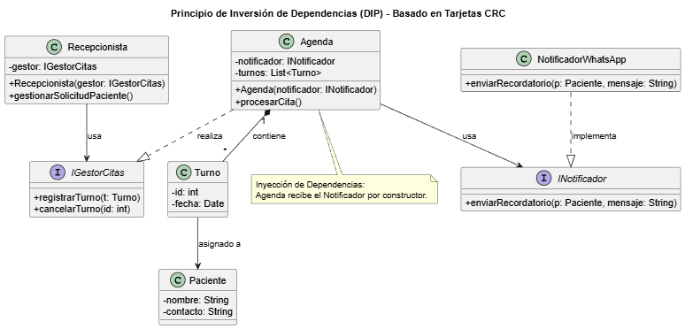

# Principio de Inversión de Dependencias (DIP)

El Principio de Inversión de Dependencias (DIP) establece que los sistemas más flexibles son aquellos en los que las dependencias del código fuente se refieren únicamente a abstracciones y no a concreciones.

## Motivación: El problema del acoplamiento en el Sistema de Turnos
En el diseño inicial basado en nuestras **Tarjetas CRC**, detectamos que la clase **Recepcionista** (clase 05) dependía directamente de la implementación concreta de la **Agenda** (clase 04) para gestionar las citas [1, 8]. A su vez, la **Agenda** dependía de un servicio de mensajería específico para notificar al **Paciente** (clase 01/02) [User interaction, 189].

Este diseño original violaba el DIP y generaba los siguientes problemas:
- **Rigidez:** Cambiar el motor de la agenda o el medio de notificación obligaba a modificar la lógica de la Recepcionista [9, 10].
- **Baja Testabilidad:** No se podía probar la lógica de asignación de **Turnos** (clase 03) sin tener operativos los servicios de notificación reales [11, 12].

## Solución mediante DIP
Para resolverlo, introdujimos interfaces que actúan como "contratos" [13, 14]:
1. **IGestorCitas:** La **Recepcionista** ahora interactúa con esta interfaz. La **Agenda** implementa este contrato.
2. **INotificador:** La **Agenda** ya no conoce a WhatsApp o Email; solo envía mensajes a través de esta abstracción [15, 16].

Gracias a la **Inyección de Dependencias**, los objetos reciben sus colaboradores por el constructor, permitiendo que el sistema sea modular y extensible [17, 18].

## Explicación de Clases Abstractas e Interfaces
- **Interfaz (Interface):** Es un conjunto de firmas de métodos sin implementación que define un comportamiento [19, 20]. En nuestro sistema, `INotificador` define *qué* se hace (enviar aviso) pero no *cómo* [21, 22].
- **Clase Abstracta:** Una clase que no se puede instanciar y sirve de base para otras, pudiendo incluir lógica compartida [23, 24]. En UML, su nombre se escribe en *cursiva* [23, 25].

## Justificación Técnica
El diagrama muestra cómo la **Recepcionista** se desacopla de la **Agenda** mediante la interfaz `IGestorCitas` [26, 27]. Al aplicar este cambio, logramos que la lógica de negocio sea independiente de los detalles técnicos (como la base de datos o el servicio de SMS), facilitando el mantenimiento y permitiendo el uso de "Mocks" para pruebas unitarias [28, 29].

## Diagrama Solid
