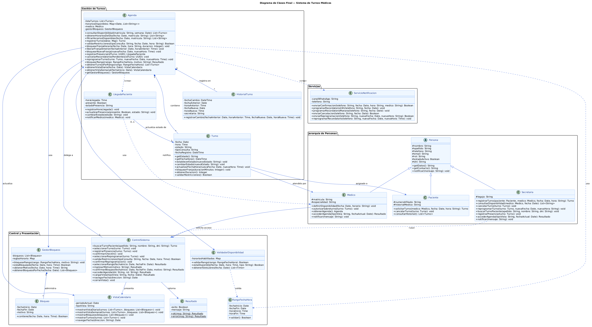

# Diagrama de Clases Final - Sistema de Turnos Médicos

---

## 1. Versión del Diagrama

| Versión | Casos de uso integrados | Fecha |
|---------|------------------------|-------|
| v1 | CU1 - Agendar Turno | 2026-06-15 |
| v2 | CU1, CU2 - Registrar Check-in | 2026-06-15 |
| v3 | CU1, CU2, CU3 - Reprogramar Turno | 2026-06-15 |
| v4 | CU1, CU2, CU3, CU4 - Bloquear Horarios, CU5 - Visualizar Agenda | 2026-06-15 |

---

## 2. Diagrama

---

## 3. Clases del Sistema

| Clase | Responsabilidad (según tarjeta CRC) | Aparece en CU |
|-------|-------------------------------------|---------------|
| Persona | Mantener datos personales, gestionar contacto y estado de actividad | CU1, CU2, CU3, CU4, CU5 |
| Paciente | Solicitar, cancelar y consultar historial de turnos médicos | CU1, CU3 |
| Medico | Definir disponibilidad horaria, atender turnos, autorizar sobreturno, acceder agenda | CU1, CU3, CU4, CU5 |
| Secretaria | Registrar, cancelar y reprogramar turnos; consultar disponibilidad; registrar presencia; acceder agenda | CU1, CU2, CU3, CU4, CU5 |
| Turno | Registrar, confirmar, cancelar y reprogramar una cita médica con estado y restricciones | CU1, CU2, CU3, CU4, CU5 |
| Agenda | Gestionar disponibilidad, registrar turnos, coordinar presencia, bloquear franjas, presentar vistas | CU1, CU2, CU3, CU4, CU5 |
| LlegadaPaciente | Registrar hora real de llegada, indicar presencia del paciente y notificar al médico | CU2 |
| HistorialTurno | Registrar cambios sobre un turno y mantener trazabilidad de reprogramaciones | CU3 |
| ServicioNotificacion | Enviar confirmación de turno, programar recordatorios automáticos y notificar cambios | CU1, CU3 |
| ControlSistema | Coordinar flujos de check-in, reprogramación, bloqueos y visualización; delegar en Agenda | CU2, CU3, CU4, CU5 |
| VistaCalendario | Mostrar vistas diaria y semanal, renderizar turnos con estados y horarios bloqueados | CU4, CU5 |
| GestorBloqueos | Registrar bloqueos de rango con motivo, verificar solapamientos, consultar por fecha | CU4, CU5 |
| ValidadorDisponibilidad | Validar rangos de fechas/horarios y verificar disponibilidad dentro de horarios habilitados | CU1, CU4 |
| Bloqueo | Representar un rango bloqueado con motivo; verificar si una fecha/hora está contenida | CU4, CU5 |
| RangoFechaHora | Encapsular un rango de fechas y horarios y validar su coherencia estructural | CU4 |
| Resultado | Encapsular el resultado de operaciones con indicador de éxito y mensaje descriptivo | CU2, CU3, CU4, CU5 |

---

## 4. Decisiones de Integración

| Inconsistencia encontrada | Issue creada | Rama fix/ | Decisión tomada | Justificación |
|--------------------------|--------------|-----------|-----------------|---------------|
| CRC de Persona no listaba a Secretaria como subclase, pero CRC de Secretaria declaraba Persona como superclase | Resuelta en PR fix/especialista-extension | fix/especialista-extension | Actualizar CRC Persona incluyendo Secretaria en subclases | Coherencia bidireccional en la jerarquía de herencia documentada |
| Las responsabilidades de check-in no figuraban en la CRC de Secretaria | Resuelta en PR #142 | fix/esp-actividades-1-2 | Documentar que Secretaria asume rol dual en check-in según RF4 | Mismo actor administrativo, diferente fase del caso de uso |
| CU5 introduce la clase Usuario como superclase de Secretaria y Medico, pero el sistema ya tiene Persona como superclase común | Detectada al integrar 05-clase-visualizar-agenda.puml | No aplica — resuelta en integración | Eliminar Usuario del diagrama final y mantener Persona como única superclase; Secretaria y Medico ya heredan de Persona y tienen accederAgenda() como método propio | Usuario duplica la responsabilidad de Persona en el dominio del STM; agregar una segunda jerarquía de herencia solo para CU5 introduce inconsistencia con el resto del modelo |
| Existen dos tarjetas CRC para ControlSistema (08-tarjeta-crc-control-sistema.md y 08-tarjeta-crc-control-sistemas.md) con contenido idéntico | Detectada al listar tarjetas CRC | No aplica — duplicado sin diferencia de contenido | Usar una sola clase ControlSistema en el diagrama final, ignorando el duplicado | Las dos tarjetas tienen el mismo nombre de clase y responsabilidades; es un duplicado de archivo sin impacto en el diseño |

La coherencia entre diagramas parciales fue verificada comparando: (1) los participantes de cada diagrama de secuencia con las clases de los diagramas parciales de cada CU, (2) los métodos invocados en los diagramas de secuencia con los métodos declarados en cada diagrama de clases, y (3) las relaciones de colaboración de las tarjetas CRC con las asociaciones del diagrama final.

---

## 5. Coherencia con Artefactos Previos

**Coherencia con boceto inicial (A1):**

El boceto inicial de A1 identificó correctamente las clases centrales del sistema: Persona, Paciente, Medico, Turno y Agenda. A medida que el análisis avanzó en A2, A3 y A4, se incorporaron clases que no estaban en el boceto pero surgieron del análisis de cada caso de uso: LlegadaPaciente (CU2), ServicioNotificacion (CU1 y CU3), HistorialTurno (CU3), ControlSistema (CU2, CU3, CU4, CU5), VistaCalendario (CU4, CU5), GestorBloqueos (CU4, CU5), ValidadorDisponibilidad (CU1, CU4), Bloqueo (CU4, CU5), RangoFechaHora (CU4) y Resultado (CU2–CU5). Estas incorporaciones refinan el boceto inicial al expandir el modelo con la complejidad real del dominio.

**Coherencia con tarjetas CRC (A2):**

Cada clase del diagrama final tiene su tarjeta CRC correspondiente. Las responsabilidades se reflejan como métodos: "Registrar bloqueo de rango con motivo" de GestorBloqueos → `bloquearRango()`, "Registrar cambios realizados sobre un turno" de HistorialTurno → `registrarCambio()`, "Mostrar vista diaria" de VistaCalendario → `mostrarVistaDiaria()`. Las colaboraciones de las tarjetas se reflejan como relaciones: Agenda colabora con GestorBloqueos (composición), ControlSistema delega en Agenda (asociación), Agenda usa ValidadorDisponibilidad (dependencia).

**Coherencia con diagramas de secuencia (A3):**

Los métodos del diagrama final surgen directamente de los mensajes de los diagramas de secuencia. En CU1: `agenda.registrarTurno()`, `turno.establecerEstado()`, `svcNotificacion.enviarConfirmacion()`. En CU2: `agenda.registrarPresencia()`, `llegadaPaciente.actualizarPresencia()`, `agenda.cancelarRecordatoriosPendientes()`. En CU3: `agenda.liberarFranjaAnterior()`, `agenda.bloquearNuevaFranja()`, `svcNotificacion.enviarReprogramacion()`. En CU4: `agenda.bloquearRango()`, `gestorBloqueos.bloquearRango()`. En CU5: `agenda.obtenerVistaDiaria()`, `vistaCalendario.mostrarVistaDiaria()`.
